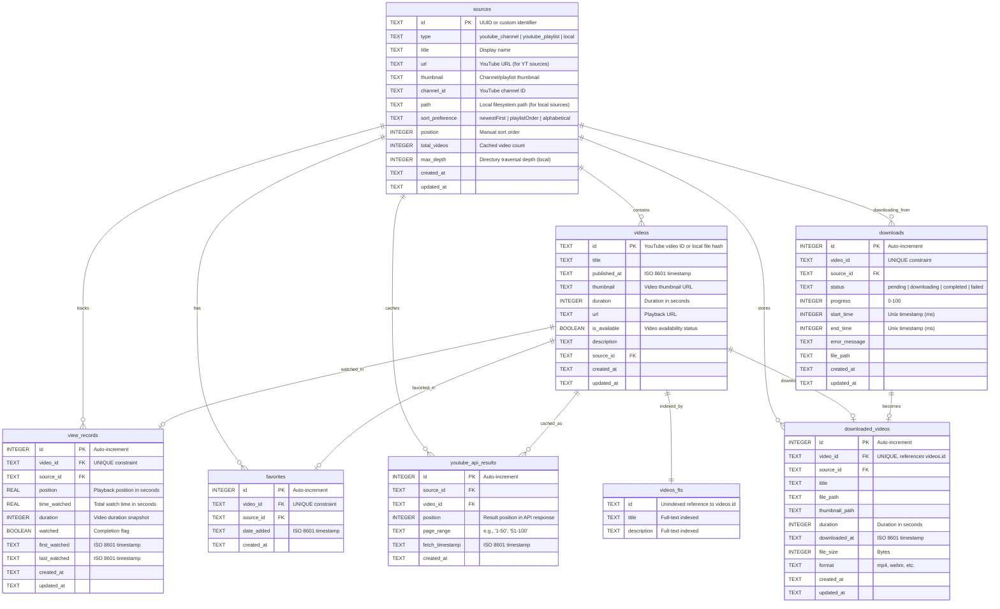

# SafeTube Database Schema

## Overview

SafeTube uses SQLite with WAL (Write-Ahead Logging) mode for its relational database. The schema supports YouTube channels/playlists, local video files, watch history tracking, favorites management, and YouTube API result caching.

**Schema Version**: Phase 1, Version 1
**Database Engine**: SQLite 3
**Mode**: WAL (Write-Ahead Logging)

## Entity-Relationship Diagram



## Phase 2 Tables

### `settings`
**Purpose**: Unified key-value storage for all application settings (consolidates mainSettings.json, pagination.json, youtubePlayer.json)

**Schema**:
```sql
CREATE TABLE settings (
    key TEXT PRIMARY KEY,                   -- Setting key (namespace.setting format)
    value TEXT,                            -- JSON-encoded setting value
    type TEXT NOT NULL DEFAULT 'string',   -- Value type hint (string|number|boolean|object)
    description TEXT,                      -- Setting description
    created_at TEXT NOT NULL DEFAULT CURRENT_TIMESTAMP,
    updated_at TEXT NOT NULL DEFAULT CURRENT_TIMESTAMP
);
```

**Key Features**:
- **Namespace format**: `main.*`, `pagination.*`, `youtube_player.*`
- **Type hints**: Stored in `type` column for proper deserialization
- **JSON values**: Complex objects stored as JSON strings in `value` column
- **Flexible schema**: No need for schema changes when adding new settings

**Example Records**:
```sql
-- From mainSettings.json
INSERT INTO settings (key, value, type) VALUES ('main.darkMode', 'false', 'boolean');
INSERT INTO settings (key, value, type) VALUES ('main.language', '"en"', 'string');

-- From pagination.json
INSERT INTO settings (key, value, type) VALUES ('pagination.pageSize', '50', 'number');
INSERT INTO settings (key, value, type) VALUES ('pagination.cacheExpiration', '3600', 'number');

-- From youtubePlayer.json
INSERT INTO settings (key, value, type) VALUES ('youtube_player.quality', '"1080p"', 'string');
INSERT INTO settings (key, value, type) VALUES ('youtube_player.autoplay', 'true', 'boolean');
```

**Query Helpers** (src/main/database/queries/settingsQueries.ts):
- `getSetting<T>(db, key, defaultValue)` - Retrieve typed setting
- `setSetting<T>(db, key, value, type)` - Store setting with type inference
- `getSettingsByNamespace(db, namespace)` - Get all settings for namespace
- `setSettingsByNamespace(db, namespace, settings)` - Bulk update namespace

**Typical Queries**:
```typescript
// Get single setting
const darkMode = await getSetting<boolean>(db, 'main.darkMode', false);

// Get all pagination settings
const paginationConfig = await getSettingsByNamespace(db, 'pagination');
// Returns: { pageSize: 50, cacheExpiration: 3600 }

// Set setting
await setSetting(db, 'main.theme', 'dark', 'string');

// Bulk update namespace
await setSettingsByNamespace(db, 'youtube_player', {
  quality: '1080p',
  autoplay: false
});
```

---

### `usage_logs`
**Purpose**: Daily usage tracking for parental time limits

**Schema**:
```sql
CREATE TABLE usage_logs (
    id INTEGER PRIMARY KEY AUTOINCREMENT,
    date TEXT NOT NULL,                     -- ISO date (YYYY-MM-DD)
    seconds_used INTEGER NOT NULL DEFAULT 0, -- Daily usage in seconds
    created_at TEXT NOT NULL DEFAULT CURRENT_TIMESTAMP,
    updated_at TEXT NOT NULL DEFAULT CURRENT_TIMESTAMP,
    UNIQUE(date)
);

CREATE INDEX idx_usage_logs_date ON usage_logs(date);
```

---

### `time_limits`
**Purpose**: Weekly time limit configuration (single-row table)

**Schema**:
```sql
CREATE TABLE time_limits (
    id INTEGER PRIMARY KEY CHECK (id = 1),  -- Single row table
    monday INTEGER NOT NULL DEFAULT 0,      -- Minutes allowed
    tuesday INTEGER NOT NULL DEFAULT 0,
    wednesday INTEGER NOT NULL DEFAULT 0,
    thursday INTEGER NOT NULL DEFAULT 0,
    friday INTEGER NOT NULL DEFAULT 0,
    saturday INTEGER NOT NULL DEFAULT 0,
    sunday INTEGER NOT NULL DEFAULT 0,
    warning_threshold_minutes INTEGER,       -- Warning threshold
    countdown_warning_seconds INTEGER,       -- Countdown warning time
    audio_warning_seconds INTEGER,           -- Audio warning time
    time_up_message TEXT,                   -- Custom time up message
    use_system_beep BOOLEAN DEFAULT 0,      -- Use system beep flag
    custom_beep_sound TEXT,                 -- Path to custom beep sound
    created_at TEXT NOT NULL DEFAULT CURRENT_TIMESTAMP,
    updated_at TEXT NOT NULL DEFAULT CURRENT_TIMESTAMP
);
```

---

### `usage_extras`
**Purpose**: Bonus time tracking with audit trail

**Schema**:
```sql
CREATE TABLE usage_extras (
    id INTEGER PRIMARY KEY AUTOINCREMENT,
    date TEXT NOT NULL,                     -- ISO date (YYYY-MM-DD)
    minutes_added INTEGER NOT NULL,         -- Extra minutes added
    reason TEXT,                           -- Optional reason for addition
    added_by TEXT DEFAULT 'admin',         -- Who added the time
    created_at TEXT NOT NULL DEFAULT CURRENT_TIMESTAMP
);

CREATE INDEX idx_usage_extras_date ON usage_extras(date);
```

---

### `downloads`
**Purpose**: Track active and recent download operations (transient data)

**Schema**:
```sql
CREATE TABLE downloads (
    id INTEGER PRIMARY KEY AUTOINCREMENT,
    video_id TEXT NOT NULL,                -- YouTube video ID being downloaded
    source_id TEXT,                        -- FK to sources table
    status TEXT NOT NULL CHECK(status IN ('pending', 'downloading', 'completed', 'failed')),
    progress INTEGER NOT NULL DEFAULT 0,   -- Download progress 0-100
    start_time INTEGER,                    -- Unix timestamp (ms)
    end_time INTEGER,                      -- Unix timestamp (ms)
    error_message TEXT,                    -- Error details if failed
    file_path TEXT,                        -- Path to downloaded file
    created_at TEXT NOT NULL DEFAULT CURRENT_TIMESTAMP,
    updated_at TEXT NOT NULL DEFAULT CURRENT_TIMESTAMP,
    UNIQUE(video_id),
    FOREIGN KEY (source_id) REFERENCES sources(id) ON DELETE CASCADE
);

CREATE INDEX idx_downloads_status ON downloads(status);
CREATE INDEX idx_downloads_video_id ON downloads(video_id);
```

**Key Features**:
- **Transient tracking**: Temporary records for active/recent downloads
- **Unique constraint**: One download record per video at a time
- **Status tracking**: pending → downloading → completed/failed
- **Progress monitoring**: 0-100 percentage for UI updates
- **Auto-cleanup**: Old completed/failed records can be purged periodically
- **Error logging**: Stores failure reasons for troubleshooting

**Lifecycle**:
1. **Start download**: INSERT with status='pending'
2. **Download progress**: UPDATE progress field
3. **Completion**: UPDATE status='completed', set end_time, file_path
4. **Failure**: UPDATE status='failed', set end_time, error_message
5. **Cleanup**: DELETE old records (completed >7 days, failed >30 days)

---

### `downloaded_videos`
**Purpose**: Permanent registry of successfully downloaded YouTube videos stored locally

**Schema**:
```sql
CREATE TABLE downloaded_videos (
    id INTEGER PRIMARY KEY AUTOINCREMENT,
    video_id TEXT NOT NULL UNIQUE,         -- YouTube video ID (matches videos.id if exists)
    source_id TEXT NOT NULL,               -- FK to sources table
    title TEXT NOT NULL,                   -- Video title at download time
    file_path TEXT NOT NULL,               -- Absolute path to video file
    thumbnail_path TEXT,                   -- Path to downloaded thumbnail
    duration INTEGER,                      -- Duration in seconds
    downloaded_at TEXT NOT NULL,           -- ISO 8601 timestamp
    file_size INTEGER,                     -- File size in bytes
    format TEXT,                           -- Video format (mp4, webm, etc.)
    created_at TEXT NOT NULL DEFAULT CURRENT_TIMESTAMP,
    updated_at TEXT NOT NULL DEFAULT CURRENT_TIMESTAMP,
    FOREIGN KEY (source_id) REFERENCES sources(id) ON DELETE CASCADE,
    FOREIGN KEY (video_id) REFERENCES videos(id) ON DELETE SET NULL
);

CREATE INDEX idx_downloaded_videos_video_id ON downloaded_videos(video_id);
CREATE INDEX idx_downloaded_videos_source_id ON downloaded_videos(source_id);
CREATE INDEX idx_downloaded_videos_downloaded_at ON downloaded_videos(downloaded_at);
CREATE INDEX idx_downloaded_videos_file_path ON downloaded_videos(file_path);
```

**Key Features**:
- **Permanent records**: Unlike downloads table, these persist indefinitely
- **Source linkage**: References both source and original video (if exists)
- **File metadata**: Stores path, size, format for local playback
- **Download history**: Tracks when videos were downloaded
- **Orphan handling**: FK to videos uses SET NULL (downloaded videos persist even if source video deleted)

**Relationship to Other Tables**:
- **videos**: Optional FK (downloaded video may reference original YouTube video)
- **sources**: Required FK (must belong to a source)
- **view_records**: Downloaded videos can have viewing history like regular videos
- **favorites**: Downloaded videos can be favorited

**Typical Queries**:
```sql
-- Check if video already downloaded
SELECT file_path FROM downloaded_videos WHERE video_id = ?;

-- Get all downloads for a source
SELECT * FROM downloaded_videos
WHERE source_id = ?
ORDER BY downloaded_at DESC;

-- Get total downloaded size by source
SELECT source_id, SUM(file_size) as total_size
FROM downloaded_videos
GROUP BY source_id;

-- Find orphaned files (file doesn't exist on disk)
SELECT * FROM downloaded_videos
WHERE file_path NOT IN (/* filesystem check */);
```

**Data Migration from JSON**:
```typescript
// Migrate downloadedVideos.json → downloaded_videos table
const jsonVideos = await readDownloadedVideos();
for (const video of jsonVideos) {
  await db.run(`
    INSERT INTO downloaded_videos (
      video_id, source_id, title, file_path, thumbnail_path,
      duration, downloaded_at
    ) VALUES (?, ?, ?, ?, ?, ?, ?)
  `, [
    video.videoId,
    video.sourceId,
    video.title,
    video.filePath,
    video.thumbnail,
    video.duration,
    video.downloadedAt
  ]);
}
```

---

## Table Descriptions

### `sources`
**Purpose**: Central registry of all video sources (YouTube channels, playlists, local directories)

**Key Features**:
- Polymorphic design supporting multiple source types via `type` column
- CHECK constraint enforces type-specific requirements:
  - `local` sources require `path`
  - `youtube_channel` and `youtube_playlist` require `url`
- Sort preferences vary by type:
  - YouTube channels: `newestFirst` (default)
  - YouTube playlists: `playlistOrder` (default)
  - Local sources: `alphabetical` (default)

**Indexes**:
- `idx_sources_type` - Fast filtering by source type
- `idx_sources_title` - Title-based searches

---

### `videos`
**Purpose**: Unified video metadata for both YouTube and local videos

**Key Features**:
- YouTube videos: `id` is the YouTube video ID (e.g., `dQw4w9WgXcQ`)
- Local videos: `id` is a content hash or unique filename identifier
- `is_available` tracks video availability (e.g., deleted YouTube videos, moved local files)
- All columns support NULL except `id`, `title`, `source_id`, timestamps
- Foreign key to `sources` with CASCADE delete

**Indexes**:
- `idx_videos_source_id` - Fast source-based queries
- `idx_videos_title` - Title searches
- `idx_videos_published_at` - Chronological sorting
- `idx_videos_updated_at` - Recently modified videos

---

### `videos_fts`
**Purpose**: Full-text search index for video titles and descriptions

**Key Features**:
- Virtual table using FTS5 (Full-Text Search version 5)
- Automatically maintained via triggers on `videos` table
- `id` column is UNINDEXED (used only for joining)
- Supports advanced search operators: `AND`, `OR`, `NOT`, `*` wildcards, phrase queries
- Content table: `videos` (synced automatically)

**Triggers**:
- `videos_fts_insert` - Adds new videos to FTS index
- `videos_fts_update` - Updates FTS index on video changes
- `videos_fts_delete` - Removes deleted videos from FTS index

**Usage Example**:
```sql
-- Search for videos with "education" in title or description
SELECT v.* FROM videos v
JOIN videos_fts vf ON v.id = vf.id
WHERE videos_fts MATCH 'education'
ORDER BY rank
LIMIT 100;
```

---

### `view_records`
**Purpose**: Watch history and playback state tracking

**Key Features**:
- One record per video (UNIQUE constraint on `video_id`)
- Tracks playback position for resume functionality
- `time_watched` accumulates total watch time (for parental controls)
- `watched` boolean marks completed videos
- `first_watched` preserved on updates (historical record)
- `last_watched` updates on every view
- Foreign keys to both `videos` and `sources` with CASCADE delete

**Indexes**:
- `idx_view_records_video_id` - Fast video lookups
- `idx_view_records_source_id` - Source-based filtering
- `idx_view_records_last_watched` - Recently watched queries
- `idx_view_records_watched` - Completion status filtering

**Typical Queries**:
- Resume playback: `SELECT position FROM view_records WHERE video_id = ?`
- Watch history: `SELECT * FROM view_records ORDER BY last_watched DESC LIMIT 50`
- Completion status: `SELECT watched FROM view_records WHERE video_id = ?`

---

### `favorites`
**Purpose**: User's favorited videos

**Key Features**:
- One favorite per video (UNIQUE constraint on `video_id`)
- Stores both `video_id` and `source_id` for context
- `date_added` tracks when favorite was created
- Foreign keys to both `videos` and `sources` with CASCADE delete

**Indexes**:
- `idx_favorites_video_id` - Fast favorite checks
- `idx_favorites_source_id` - Source-based filtering
- `idx_favorites_date_added` - Chronological sorting

**Typical Queries**:
- Check if favorited: `SELECT COUNT(*) FROM favorites WHERE video_id = ?`
- List all favorites: `SELECT * FROM favorites ORDER BY date_added DESC`
- Toggle favorite: `INSERT OR REPLACE` / `DELETE`

---

### `youtube_api_results`
**Purpose**: Cache YouTube API responses for pagination

**Key Features**:
- Stores page-based results (e.g., videos 1-50, 51-100)
- `page_range` format: `"1-50"`, `"51-100"`, `"101-150"`
- `position` tracks result order within API response
- UNIQUE constraint on `(source_id, video_id, page_range)` prevents duplicates
- `fetch_timestamp` enables cache invalidation
- Foreign keys to both `sources` and `videos` with CASCADE delete

**Indexes**:
- `idx_youtube_api_source_id` - Source-based queries
- `idx_youtube_api_page_range` - Page-based retrieval
- `idx_youtube_api_position` - Position-based sorting
- `idx_youtube_api_fetch_timestamp` - Cache freshness checks

**Cache Strategy**:
- Results stored per page (50 videos per page default)
- Cache hit: Return results from `youtube_api_results` + JOIN `videos`
- Cache miss: Fetch from YouTube API, store results, return data
- Cache invalidation: Based on `fetch_timestamp` age

**Typical Queries**:
- Get cached page:
  ```sql
  SELECT v.* FROM youtube_api_results y
  JOIN videos v ON y.video_id = v.id
  WHERE y.source_id = ? AND y.page_range = ?
  ORDER BY y.position ASC
  ```
- Clear cache: `DELETE FROM youtube_api_results WHERE source_id = ?`

---

### `schema_version`
**Purpose**: Track database schema version and migration state

**Key Features**:
- Single row table (CHECK constraint: `id = 1`)
- Tracks `version` number and migration `phase`
- Auto-updates `updated_at` on schema changes

**Current State**:
- Version: 1
- Phase: phase1

---

## Relationships and Constraints

### Foreign Key Relationships

All foreign keys use **CASCADE DELETE** to maintain referential integrity:

```sql
videos.source_id → sources.id (ON DELETE CASCADE)
view_records.video_id → videos.id (ON DELETE CASCADE)
view_records.source_id → sources.id (ON DELETE CASCADE)
favorites.video_id → videos.id (ON DELETE CASCADE)
favorites.source_id → sources.id (ON DELETE CASCADE)
youtube_api_results.source_id → sources.id (ON DELETE CASCADE)
youtube_api_results.video_id → videos.id (ON DELETE CASCADE)
```

**Cascade Behavior Example**:
- Deleting a source automatically deletes:
  - All videos from that source
  - All view records for those videos
  - All favorites for those videos
  - All YouTube API cache results for that source

### Unique Constraints

- `view_records.video_id` - One view record per video
- `favorites.video_id` - One favorite entry per video
- `youtube_api_results(source_id, video_id, page_range)` - Prevents duplicate cache entries

### Check Constraints

**sources table**:
```sql
CHECK (
  (type = 'local' AND path IS NOT NULL) OR
  (type IN ('youtube_channel', 'youtube_playlist') AND url IS NOT NULL)
)
```
Enforces that:
- Local sources must have a `path`
- YouTube sources must have a `url`

---

## Common Query Patterns

### 1. **Get videos for a source with pagination**
```sql
-- Get page 2 (videos 51-100) for a YouTube channel
SELECT v.* FROM youtube_api_results y
JOIN videos v ON y.video_id = v.id
WHERE y.source_id = ? AND y.page_range = '51-100'
ORDER BY y.position ASC;

-- Alternative: Direct video query (for local sources)
SELECT * FROM videos
WHERE source_id = ?
ORDER BY published_at DESC
LIMIT 50 OFFSET 50;
```

### 2. **Search videos across all sources**
```sql
SELECT v.* FROM videos v
JOIN videos_fts vf ON v.id = vf.id
WHERE videos_fts MATCH 'search query'
ORDER BY rank
LIMIT 100;
```

### 3. **Get watch history with video metadata**
```sql
SELECT vr.*, v.title, v.thumbnail, v.duration
FROM view_records vr
LEFT JOIN videos v ON vr.video_id = v.id
ORDER BY vr.last_watched DESC
LIMIT 50;
```

### 4. **Get favorites with source context**
```sql
SELECT f.*, v.title, v.thumbnail, s.title as source_title
FROM favorites f
LEFT JOIN videos v ON f.video_id = v.id
LEFT JOIN sources s ON f.source_id = s.id
ORDER BY f.date_added DESC;
```

### 5. **Resume playback for a video**
```sql
SELECT position, time_watched, duration, watched
FROM view_records
WHERE video_id = ?;
```

### 6. **Update watch progress**
```sql
INSERT OR REPLACE INTO view_records (
  video_id, source_id, position, time_watched, duration, watched,
  first_watched, last_watched
) VALUES (?, ?, ?, ?, ?, ?, ?, ?);
```

### 7. **Delete source with cascade cleanup**
```sql
-- This single DELETE will cascade to:
-- - videos (via FK)
-- - view_records (via FK to videos)
-- - favorites (via FK to videos)
-- - youtube_api_results (via FK to source)
DELETE FROM sources WHERE id = ?;
```

---

## Performance Considerations

### Indexed Columns
All frequently queried columns are indexed:
- Primary keys (automatic)
- Foreign keys (explicit indexes)
- Sort/filter columns (`type`, `title`, `published_at`, `last_watched`, etc.)
- FTS columns (`videos_fts.title`, `videos_fts.description`)

### Query Optimization Tips

1. **Use parameterized queries** to leverage SQLite's query planner cache
2. **Batch operations** using transactions for bulk inserts/updates
3. **Leverage FTS5** for text searches instead of `LIKE` clauses
4. **Use covering indexes** where possible (all query columns in index)
5. **Analyze query plans** with `EXPLAIN QUERY PLAN` for slow queries

### WAL Mode Benefits
- Concurrent reads during writes
- Faster write performance
- Better crash recovery
- No database locking for readers

---

## Migration and Schema Management

### Current Implementation
- Schema managed by `SimpleSchemaManager` class
- Programmatic table creation (no SQL files)
- Version tracking via `schema_version` table
- Automatic column migration for `sources` table (sort_order → position)

### Adding New Columns (Example)
```typescript
// Update SimpleSchemaManager.createXxxTable()
await this.databaseService.run(`
  ALTER TABLE videos ADD COLUMN new_column TEXT
`);

// Update schema version
await this.databaseService.run(`
  UPDATE schema_version SET version = 2, updated_at = CURRENT_TIMESTAMP WHERE id = 1
`);
```

### Schema Validation
```typescript
const { isValid, errors } = await schemaManager.validatePhase1Schema();
if (!isValid) {
  console.error('Schema validation failed:', errors);
}
```

---

## Data Types and SQLite Behavior

### SQLite Type Affinity
- `TEXT` - String values (ISO 8601 for timestamps)
- `INTEGER` - Signed integers (64-bit)
- `REAL` - Floating-point numbers
- `BOOLEAN` - Stored as INTEGER (0 = false, 1 = true)

### Timestamp Format
All timestamps use **ISO 8601 format**: `YYYY-MM-DDTHH:MM:SS.sssZ`

Example: `2025-10-03T14:30:00.000Z`

### NULL Handling
- Most columns allow NULL (except PKs and required fields)
- Use `IS NULL` / `IS NOT NULL` for comparisons (never `= NULL`)
- `COALESCE(column, default_value)` for NULL-safe defaults

---

## Testing with In-Memory Database

### Creating In-Memory Instance
```typescript
import DatabaseService from './services/DatabaseService';
import SimpleSchemaManager from './database/SimpleSchemaManager';

// In-memory database for tests
const testDb = new DatabaseService(':memory:');
const schemaManager = new SimpleSchemaManager(testDb);

// Initialize schema
await schemaManager.initializePhase1Schema();

// Run tests...
```

### Test Data Fixtures
```typescript
// Insert test source
await testDb.run(`
  INSERT INTO sources (id, type, title, url)
  VALUES ('test-channel', 'youtube_channel', 'Test Channel', 'https://youtube.com/@test')
`);

// Insert test video
await testDb.run(`
  INSERT INTO videos (id, title, source_id)
  VALUES ('test-video', 'Test Video', 'test-channel')
`);
```

---

## Security Considerations

### SQL Injection Prevention
- **Always use parameterized queries** (prepared statements)
- Never concatenate user input into SQL strings
- Use `?` placeholders for parameters

**Good**:
```typescript
await db.run('SELECT * FROM videos WHERE id = ?', [videoId]);
```

**Bad**:
```typescript
await db.run(`SELECT * FROM videos WHERE id = '${videoId}'`); // VULNERABLE!
```

### Foreign Key Enforcement
- Foreign keys are enabled by default in `DatabaseService`
- CASCADE deletes maintain referential integrity
- No orphaned records possible

### Data Validation
- CHECK constraints enforce data integrity at DB level
- Application-level validation in IPC handlers
- Type-safe query helpers prevent type mismatches

---

## References

- **Schema Manager**: `src/main/database/SimpleSchemaManager.ts`
- **Database Service**: `src/main/services/DatabaseService.ts`
- **Query Helpers**: `src/main/database/queries/`
- **IPC Handlers**: `src/main/ipc/databaseHandlers.ts`
- **Type Definitions**: `src/main/database/queries/types.ts`
