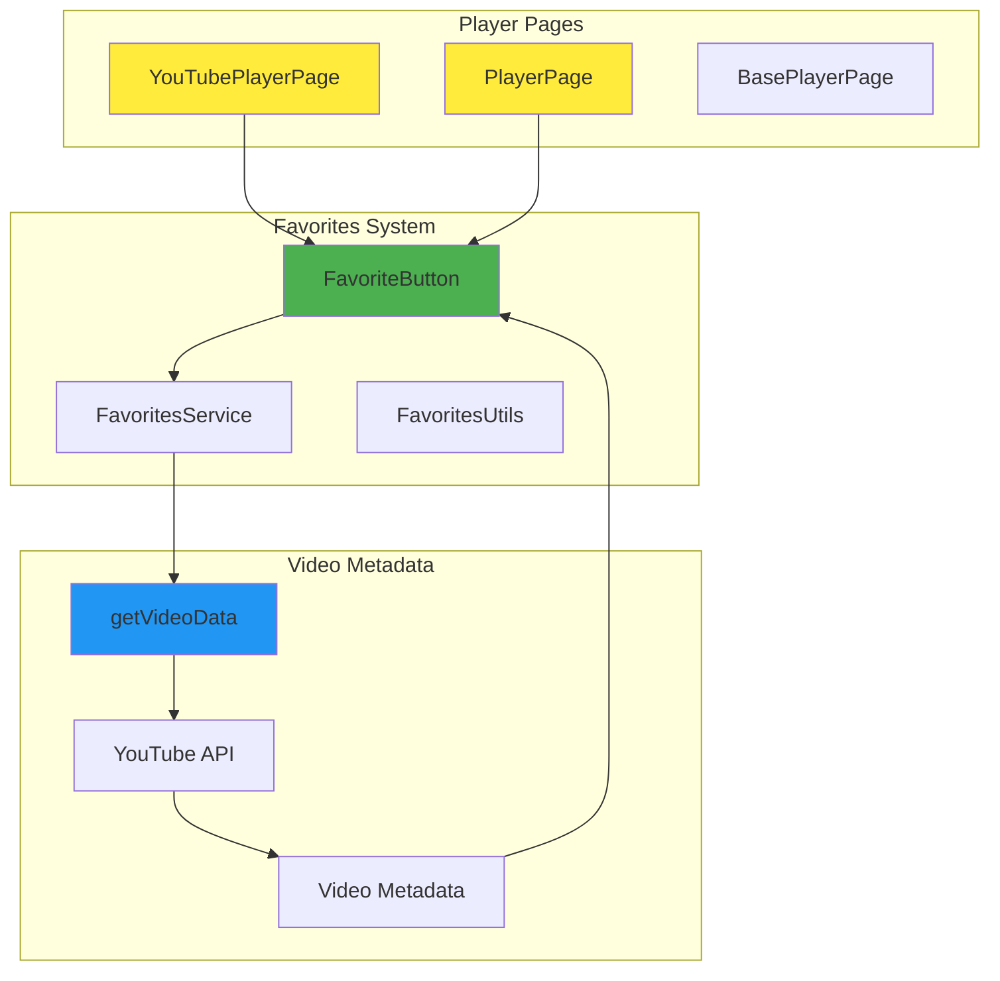
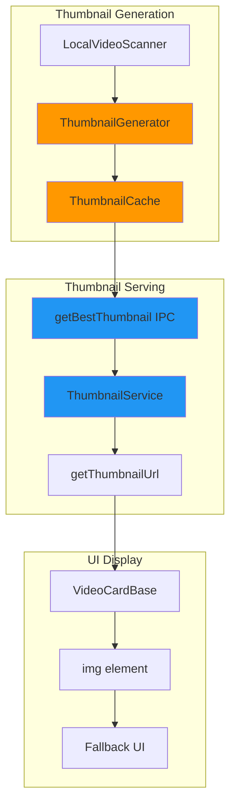

# Favorites Fixes Technical Design

## Overview

This design document addresses the architectural fixes needed to enable YouTube video favorites and repair local video thumbnail functionality in SafeTube. The solution focuses on player integration, metadata handling, and thumbnail service improvements.

## Current Implementation Analysis

### What Works
- **Local video favorites**: The basic favorites infrastructure works for local videos
- **Favorites UI components**: `FavoriteButton` and `VideoCardBase` integration exists
- **Data persistence**: JSON-based favorites storage is functional
- **IPC communication**: Main-renderer communication for favorites operations is established

### Critical Issues Identified

#### 1. YouTube Favorites Integration Gaps

**Issue**: YouTube videos cannot be favorited because the player pages don't integrate with the favorites system.

**Root Causes**:
- `YouTubePlayerPage.tsx` doesn't include `FavoriteButton` component
- `PlayerPage.tsx` includes `FavoriteButton` but lacks proper YouTube video metadata extraction
- No integration between YouTube iframe API and favorites system
- YouTube video metadata (title, thumbnail, duration) not properly captured during favoriting

**Impact**: YouTube videos from channels and playlists cannot be saved as favorites, limiting the feature's usefulness.

#### 2. Local Video Thumbnail System Failure

**Issue**: Local videos display "Video unavailable" instead of proper thumbnails.

**Root Causes**:
- Thumbnail generation process exists but may not be triggered consistently
- Thumbnail serving mechanism has file access or MIME type issues
- Cache key generation inconsistencies between thumbnail creation and retrieval
- `getBestThumbnail` IPC handler only returns thumbnails for existing cached files but doesn't trigger generation

**Impact**: Local videos appear unprofessional and are difficult to identify without proper visual cues.

## Technical Solution Architecture

### Component Integration Strategy

#### YouTube Player Integration



#### Local Thumbnail Processing Pipeline



## Implementation Details

### 1. YouTube Player Favorites Integration

#### YouTubePlayerPage Enhancement

**File**: `src/renderer/pages/YouTubePlayerPage.tsx`

**Changes Needed**:
```tsx
// Add FavoriteButton import and state management
import { FavoriteButton } from '../components/video/FavoriteButton';

// Add favorite status state
const [isFavorite, setIsFavorite] = useState<boolean>(false);

// Add favorite check effect
useEffect(() => {
  const checkFavoriteStatus = async () => {
    if (video?.id) {
      const status = await FavoritesService.isFavorite(video.id, 'youtube');
      setIsFavorite(status);
    }
  };
  checkFavoriteStatus();
}, [video?.id]);

// Add favorite toggle handler
const handleFavoriteToggle = async (videoId: string, newStatus: boolean) => {
  if (video) {
    await FavoritesService.toggleFavorite(
      video.id,
      'youtube',  // Source type
      'youtube',  // Video type
      video.title,
      video.thumbnail,
      video.duration
    );
    setIsFavorite(newStatus);
  }
};

// Add to BasePlayerPage children (after DownloadUI)
<FavoriteButton
  videoId={video?.id || ''}
  source="youtube"
  type="youtube"
  title={video?.title || ''}
  thumbnail={video?.thumbnail || ''}
  duration={video?.duration || 0}
  isFavorite={isFavorite}
  onToggle={handleFavoriteToggle}
  size="large"
  showLabel={true}
  className="mt-4"
/>
```

#### PlayerPage Enhancement

**File**: `src/renderer/pages/PlayerPage.tsx`

**Issues to Fix**:
1. Ensure YouTube video metadata is properly captured
2. Fix video type detection for MediaSource videos
3. Improve source identification for favorites

**Changes Needed**:
```tsx
// Enhanced video metadata extraction for YouTube videos
const getVideoMetadataForFavorites = useCallback(() => {
  if (!video) return null;

  // For YouTube videos, ensure we have proper metadata
  if (video.type === 'youtube') {
    return {
      videoId: video.id,
      source: video.sourceId || 'youtube',
      type: 'youtube' as const,
      title: video.title,
      thumbnail: video.thumbnail || extractThumbnailFromStreams(video),
      duration: video.duration || 0
    };
  }

  // For local videos, ensure proper path handling
  if (video.type === 'local') {
    return {
      videoId: video.id,
      source: video.sourceId || 'local',
      type: 'local' as const,
      title: video.title,
      thumbnail: video.thumbnail || '',
      duration: video.duration || 0
    };
  }

  return null;
}, [video]);

// Enhanced favorite toggle handler
const handleFavoriteToggle = async (videoId: string, newStatus: boolean) => {
  const metadata = getVideoMetadataForFavorites();
  if (metadata) {
    await FavoritesService.toggleFavorite(
      metadata.videoId,
      metadata.source,
      metadata.type,
      metadata.title,
      metadata.thumbnail,
      metadata.duration
    );
  }
};
```

### 2. Local Video Thumbnail System Fix

#### Thumbnail Generation Enhancement

**File**: `src/main/index.ts` (getBestThumbnail handler)

**Current Issue**: Handler only returns existing thumbnails but doesn't generate them.

**Solution**: Enhance handler to trigger generation when thumbnails don't exist:

```typescript
ipcMain.handle('get-best-thumbnail', async (event, videoId: string) => {
  try {
    const { parseVideoId } = await import('../shared/fileUtils');
    const { getThumbnailCacheKey } = await import('../shared/thumbnailUtils');
    const { getThumbnailUrl } = await import('./services/thumbnailService');

    const parsed = parseVideoId(videoId);
    if (!parsed.success) {
      logVerbose('[Main] Failed to parse video ID:', parsed.error);
      return null;
    }

    // Only handle local videos
    if (parsed.parsed?.type === 'local') {
      const cacheKey = getThumbnailCacheKey(videoId, 'local');
      const cachedThumbnailPath = AppPaths.getThumbnailPath(`${cacheKey}.jpg`);

      // If thumbnail exists, return it
      if (fs.existsSync(cachedThumbnailPath)) {
        const thumbnailUrl = getThumbnailUrl(cachedThumbnailPath);
        return thumbnailUrl;
      }

      // If thumbnail doesn't exist, try to generate it
      try {
        const { extractPathFromVideoId } = await import('../shared/fileUtils');
        const actualPath = extractPathFromVideoId(videoId);

        if (actualPath && fs.existsSync(actualPath)) {
          // Trigger thumbnail generation
          const { generateVideoThumbnail } = await import('./services/thumbnailService');
          const generated = await generateVideoThumbnail(actualPath, cachedThumbnailPath);

          if (generated && fs.existsSync(cachedThumbnailPath)) {
            const thumbnailUrl = getThumbnailUrl(cachedThumbnailPath);
            logVerbose('[Main] Generated and returned new thumbnail for:', videoId);
            return thumbnailUrl;
          }
        }
      } catch (generationError) {
        logVerbose('[Main] Error generating thumbnail for:', videoId, generationError);
      }
    }

    return null;
  } catch (error) {
    logVerbose('[Main] Error getting best thumbnail for:', videoId, error);
    return null;
  }
});
```

#### Thumbnail Service Implementation

**File**: `src/main/services/thumbnailService.ts` (create if doesn't exist)

```typescript
import { spawn } from 'child_process';
import * as fs from 'fs';
import * as path from 'path';

export async function generateVideoThumbnail(
  videoPath: string,
  outputPath: string
): Promise<boolean> {
  return new Promise((resolve) => {
    // Ensure output directory exists
    const outputDir = path.dirname(outputPath);
    if (!fs.existsSync(outputDir)) {
      fs.mkdirSync(outputDir, { recursive: true });
    }

    // Use ffmpeg to extract thumbnail at 10% of video duration
    const ffmpeg = spawn('ffmpeg', [
      '-i', videoPath,
      '-ss', '00:00:10',  // Seek to 10 seconds
      '-vframes', '1',    // Extract 1 frame
      '-y',               // Overwrite output
      outputPath
    ]);

    let hasError = false;

    ffmpeg.stderr.on('data', (data) => {
      // ffmpeg outputs to stderr, this is normal
      // Only log errors, not progress info
      const message = data.toString();
      if (message.includes('Error') || message.includes('Failed')) {
        console.error('[ThumbnailService] FFmpeg error:', message);
        hasError = true;
      }
    });

    ffmpeg.on('close', (code) => {
      if (code === 0 && !hasError && fs.existsSync(outputPath)) {
        resolve(true);
      } else {
        resolve(false);
      }
    });

    ffmpeg.on('error', (error) => {
      console.error('[ThumbnailService] Spawn error:', error);
      resolve(false);
    });
  });
}

export function getThumbnailUrl(thumbnailPath: string): string {
  // Convert absolute path to file:// URL
  return `file://${thumbnailPath}`;
}
```

#### LocalVideoScanner Integration

**File**: `src/preload/localVideoScanner.ts`

**Enhancement**: Ensure thumbnail generation is triggered during video scanning:

```typescript
// In the scanFolder method, after video discovery
for (const video of videos) {
  try {
    // Trigger thumbnail generation for videos without thumbnails
    if (!video.thumbnail || video.thumbnail.trim() === '') {
      const thumbnail = await window.electron.getBestThumbnail(video.id);
      if (thumbnail) {
        video.thumbnail = thumbnail;
      }
    }
  } catch (error) {
    logVerbose('[LocalVideoScanner] Error getting thumbnail for:', video.id, error);
  }
}
```

### 3. Video Metadata Handling Improvements

#### Source Type Normalization

**File**: `src/shared/favoritesUtils.ts` (enhance existing)

```typescript
export function normalizeVideoSource(video: any): {
  videoId: string;
  source: string;
  type: 'youtube' | 'local' | 'dlna';
  title: string;
  thumbnail: string;
  duration: number;
} {
  // Normalize video ID and source information
  let normalizedId = video.id;
  let sourceType: 'youtube' | 'local' | 'dlna' = video.type;
  let sourceId = video.sourceId || video.source || sourceType;

  // Handle YouTube videos with proper ID extraction
  if (sourceType === 'youtube') {
    // Remove any youtube: prefix if present
    if (normalizedId.startsWith('youtube:')) {
      normalizedId = normalizedId.substring(8);
    }
    sourceId = video.sourceId || 'youtube';
  }

  // Handle local videos with proper path encoding
  if (sourceType === 'local') {
    // Ensure proper local: prefix for storage
    if (!normalizedId.startsWith('local:')) {
      normalizedId = `local:${normalizedId}`;
    }
    sourceId = video.sourceId || 'local';
  }

  return {
    videoId: normalizedId,
    source: sourceId,
    type: sourceType,
    title: video.title || `Video ${normalizedId}`,
    thumbnail: video.thumbnail || '',
    duration: video.duration || 0
  };
}
```

### 4. Error Handling and Fallbacks

#### Thumbnail Fallback System

**File**: `src/renderer/components/video/VideoCardBase.tsx` (enhance existing)

```tsx
// Enhanced thumbnail error handling
const [thumbnailError, setThumbnailError] = useState(false);
const [thumbnailLoading, setThumbnailLoading] = useState(false);

const handleThumbnailError = async (e: React.SyntheticEvent<HTMLImageElement>) => {
  e.currentTarget.style.display = 'none';
  setThumbnailError(true);

  // For local videos, try to regenerate thumbnail
  if (type === 'local' && !thumbnailLoading) {
    setThumbnailLoading(true);
    try {
      const newThumbnail = await window.electron.getBestThumbnail(id);
      if (newThumbnail && newThumbnail !== thumbnail) {
        // Update the thumbnail and retry
        setThumbnailError(false);
        e.currentTarget.src = newThumbnail;
        e.currentTarget.style.display = 'block';
      }
    } catch (error) {
      console.error('[VideoCardBase] Error regenerating thumbnail:', error);
    } finally {
      setThumbnailLoading(false);
    }
  }

  // Show fallback
  const fallback = e.currentTarget.nextElementSibling as HTMLElement;
  if (fallback) fallback.style.display = 'flex';
};
```

#### YouTube API Error Handling

**File**: `src/renderer/services/favoritesService.ts` (enhance existing)

```typescript
// Enhanced YouTube metadata fallback
static async getFallbackYouTubeMetadata(videoId: string): Promise<{
  title: string;
  thumbnail: string;
  duration: number;
}> {
  try {
    // Try to extract metadata from currently loaded video data
    if (global.currentVideos) {
      const video = global.currentVideos.find(v => v.id === videoId);
      if (video) {
        return {
          title: video.title || `YouTube Video ${videoId}`,
          thumbnail: video.thumbnail || '',
          duration: video.duration || 0
        };
      }
    }

    // Generate fallback metadata
    return {
      title: `YouTube Video ${videoId}`,
      thumbnail: `https://img.youtube.com/vi/${videoId}/hqdefault.jpg`,
      duration: 0
    };
  } catch (error) {
    logVerbose('[FavoritesService] Error getting fallback metadata:', error);
    return {
      title: `YouTube Video ${videoId}`,
      thumbnail: '',
      duration: 0
    };
  }
}
```

## Integration Testing Strategy

### YouTube Favorites Testing

1. **Iframe Player Testing**:
   - Navigate to YouTube video via iframe player
   - Verify favorite button appears and functions
   - Confirm video appears in favorites with correct metadata
   - Test favorite removal from player page

2. **Embedded Player Testing**:
   - Navigate to YouTube video via embedded player
   - Verify favorite button appears and functions
   - Confirm consistent video ID between players
   - Test cross-player favorite status consistency

3. **Grid Integration Testing**:
   - Verify favorited YouTube videos show stars in grids
   - Test favorite toggling from video grids
   - Confirm favorites source displays YouTube videos correctly

### Local Thumbnail Testing

1. **Thumbnail Generation Testing**:
   - Scan local video directory and verify thumbnails are generated
   - Test thumbnail regeneration for corrupted files
   - Verify thumbnail caching and retrieval

2. **Favorites Integration Testing**:
   - Add local videos to favorites and verify thumbnails appear
   - Test thumbnail serving in favorites view
   - Confirm fallback behavior for missing thumbnails

## Performance Considerations

### Thumbnail Generation Optimization

1. **Asynchronous Processing**: Generate thumbnails in background without blocking UI
2. **Batch Processing**: Process multiple videos efficiently during scanning
3. **Cache Management**: Implement intelligent cache cleanup to prevent disk bloat
4. **Error Recovery**: Retry thumbnail generation with different parameters on failure

### YouTube Metadata Caching

1. **Metadata Persistence**: Cache YouTube video metadata to reduce API calls
2. **Thumbnail Proxying**: Consider caching YouTube thumbnails locally for offline access
3. **Batch Status Checks**: Optimize favorite status checking for large video grids

## Security Considerations

### File System Access

1. **Path Validation**: Validate all file paths to prevent directory traversal
2. **Permission Checks**: Verify read/write permissions before file operations
3. **Input Sanitization**: Sanitize video IDs and file paths in all operations

### YouTube Integration

1. **API Rate Limiting**: Respect YouTube API quotas and implement backoff strategies
2. **Content Validation**: Validate YouTube video IDs and metadata before processing
3. **Network Security**: Handle network errors gracefully without exposing sensitive information

This design provides a comprehensive solution to both the YouTube favorites integration and local thumbnail issues while maintaining the existing architecture patterns and ensuring robust error handling.