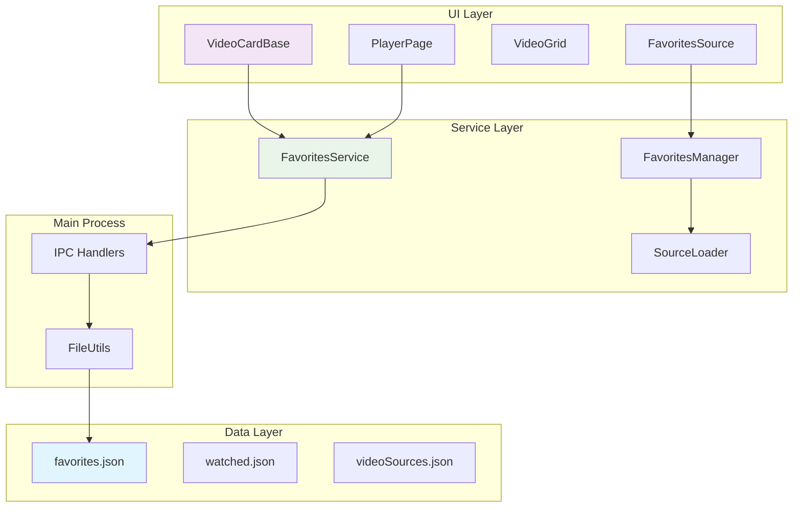

# Favorites System Design

## Overview

The favorites system allows users to star/unstar videos and view their favorited videos in a dedicated source. It follows SafeTube's established patterns for data persistence, UI components, and cross-source compatibility.

## Architecture Overview

### System Integration Points



## Data Design

### Core Data Structures

#### FavoriteVideo Interface
```typescript
export interface FavoriteVideo {
  videoId: string;           // Unique video identifier (cross-source compatible)
  addedAt: string;          // ISO date string when favorited
  source: string;           // Source ID where video originates
  type: 'youtube' | 'local' | 'dlna';  // Video type for playback routing

  // Cached metadata for fast favorites view loading
  title: string;            // Video title
  thumbnail: string;        // Thumbnail URL or path
  duration: number;         // Video duration in seconds

  // Optional metadata for enhanced UX
  lastWatched?: string;     // ISO date when last watched
  notes?: string;           // User notes (future feature)
  tags?: string[];          // User tags (future feature)
}
```

#### Favorites Configuration File
**Location**: `config/favorites.json`
```json
{
  "favorites": [
    {
      "videoId": "dQw4w9WgXcQ",
      "addedAt": "2025-09-17T14:30:00.000Z",
      "source": "yt-channel-1",
      "type": "youtube",
      "title": "Never Gonna Give You Up",
      "thumbnail": "https://i.ytimg.com/vi/dQw4w9WgXcQ/maxresdefault.jpg",
      "duration": 212,
      "lastWatched": "2025-09-17T15:45:00.000Z"
    },
    {
      "videoId": "local:/path/to/video.mp4",
      "addedAt": "2025-09-17T16:20:00.000Z",
      "source": "local-folder-1",
      "type": "local",
      "title": "Family Vacation 2024",
      "thumbnail": "/thumbnails/local-video.jpg",
      "duration": 1800
    }
  ],
  "settings": {
    "sortOrder": "addedAt",     // "addedAt" | "title" | "lastWatched"
    "sortDirection": "desc",    // "asc" | "desc"
    "showRemovalConfirmation": true
  }
}
```

### Data Management Services

#### FavoritesService
**Location**: `src/renderer/services/favoritesService.ts`

Handles all favorites operations in the renderer process:

```typescript
export class FavoritesService {
  // Core CRUD operations
  static async getFavorites(): Promise<FavoriteVideo[]>
  static async addFavorite(video: Omit<FavoriteVideo, 'addedAt'>): Promise<void>
  static async removeFavorite(videoId: string): Promise<void>
  static async isFavorite(videoId: string): Promise<boolean>
  static async toggleFavorite(video: VideoData): Promise<boolean>

  // Batch operations
  static async bulkAddFavorites(videos: VideoData[]): Promise<void>
  static async bulkRemoveFavorites(videoIds: string[]): Promise<void>

  // Metadata management
  static async updateFavoriteMetadata(videoId: string, metadata: Partial<FavoriteVideo>): Promise<void>
  static async refreshFavoritesMetadata(): Promise<void>

  // Integration helpers
  static async syncWithWatchHistory(): Promise<void>
  static async cleanupOrphanedFavorites(): Promise<void>
}
```

#### Main Process File Operations
**Location**: `src/main/fileUtils.ts` (extended)

```typescript
// Add to existing fileUtils.ts
export async function readFavorites(): Promise<FavoriteVideo[]>
export async function writeFavorites(favorites: FavoriteVideo[]): Promise<void>
export async function addFavoriteVideo(favorite: FavoriteVideo): Promise<void>
export async function removeFavoriteVideo(videoId: string): Promise<void>
export async function getFavoriteById(videoId: string): Promise<FavoriteVideo | null>
```

## Component Architecture

### UI Component Integration

#### VideoCardBase Star Icon Enhancement
**File**: `src/renderer/components/video/VideoCardBase.tsx`

Add star overlay and hover functionality:

```tsx
interface VideoCardBaseProps {
  // ... existing props
  isFavorite?: boolean;
  onFavoriteToggle?: (videoId: string, isFavorite: boolean) => void;
  showFavoriteIcon?: boolean; // Control star visibility
}

// Star icon overlay (positioned in top-left corner)
{showFavoriteIcon && (
  <div className="absolute top-2 left-2 z-30">
    <FavoriteButton
      videoId={id}
      isFavorite={isFavorite}
      onToggle={onFavoriteToggle}
      size="small"
    />
  </div>
)}
```

#### FavoriteButton Component
**File**: `src/renderer/components/video/FavoriteButton.tsx`

Reusable star button component:

```tsx
interface FavoriteButtonProps {
  videoId: string;
  isFavorite?: boolean;
  onToggle?: (videoId: string, isFavorite: boolean) => void;
  size?: 'small' | 'medium' | 'large';
  showLabel?: boolean;
}

export const FavoriteButton: React.FC<FavoriteButtonProps> = ({
  videoId,
  isFavorite: initialFavorite,
  onToggle,
  size = 'medium',
  showLabel = false
}) => {
  // Local state management with optimistic updates
  // Click handler with feedback animation
  // Error handling and rollback on failure
}
```

#### PlayerPage Integration
**File**: `src/renderer/pages/PlayerPage.tsx`

Add favorites controls to player interface:

```tsx
// Add to player controls area (near download button)
<div className="player-controls-section">
  <FavoriteButton
    videoId={videoId}
    size="large"
    showLabel={true}
    onToggle={handleFavoriteToggle}
  />
</div>

// Handle favorite toggle with video metadata
const handleFavoriteToggle = async (videoId: string, isFavorite: boolean) => {
  if (video) {
    await FavoritesService.toggleFavorite({
      videoId: video.id,
      source: getCurrentSource(),
      type: video.type,
      title: video.title,
      thumbnail: video.thumbnail,
      duration: video.duration
    });
  }
};
```

### Favorites Source Integration

#### FavoritesSourceLoader
**File**: `src/renderer/services/favoritesSourceLoader.ts`

Integrates favorites with existing source system:

```typescript
export class FavoritesSourceLoader implements SourceLoader {
  async loadVideos(): Promise<VideoCardBaseProps[]> {
    const favorites = await FavoritesService.getFavorites();

    return favorites.map(fav => ({
      id: fav.videoId,
      title: fav.title,
      thumbnail: fav.thumbnail,
      duration: fav.duration,
      type: fav.type,
      isFavorite: true,
      showFavoriteIcon: true,
      // Integrate with watch history
      watched: await isVideoWatched(fav.videoId),
      resumeAt: await getResumePosition(fav.videoId),
      progress: await getWatchProgress(fav.videoId)
    }));
  }

  async getSourceMetadata(): Promise<SourceMetadata> {
    const count = await FavoritesService.getFavorites().then(favs => favs.length);
    return {
      id: 'favorites',
      title: 'Favorites',
      type: 'favorites',
      count,
      thumbnail: '⭐', // Star emoji as fallback
      sortOrder: 'manual'
    };
  }
}
```

#### Source System Integration
**File**: `src/renderer/services/sourceManager.ts` (if exists, or create)

Register favorites as a built-in source:

```typescript
export class SourceManager {
  private static builtInSources = [
    {
      id: 'favorites',
      type: 'favorites',
      title: 'Favorites',
      loader: FavoritesSourceLoader,
      icon: '⭐',
      isBuiltIn: true,
      alwaysVisible: true
    }
  ];

  static async getAllSources(): Promise<SourceDefinition[]> {
    const configSources = await loadVideoSources();
    return [...this.builtInSources, ...configSources];
  }
}
```

## Integration Points

### Cross-Source Video Identification

#### Video ID Encoding Strategy
The system must handle video IDs across different source types:

```typescript
export class VideoIdUtils {
  // Normalize video IDs for consistent storage
  static normalizeVideoId(videoId: string, type: VideoType): string {
    switch (type) {
      case 'youtube':
        return videoId; // Already normalized
      case 'local':
        return `local:${encodeURIComponent(videoId)}`;
      case 'dlna':
        return `dlna:${encodeURIComponent(videoId)}`;
      default:
        return videoId;
    }
  }

  // Parse normalized video IDs back to original format
  static parseVideoId(normalizedId: string): ParsedVideoId {
    if (normalizedId.startsWith('local:')) {
      return {
        type: 'local',
        originalId: decodeURIComponent(normalizedId.substring(6))
      };
    }
    if (normalizedId.startsWith('dlna:')) {
      return {
        type: 'dlna',
        originalId: decodeURIComponent(normalizedId.substring(5))
      };
    }
    return {
      type: 'youtube',
      originalId: normalizedId
    };
  }
}
```

### Watch History Integration

#### Automatic Metadata Sync
Keep favorites metadata synchronized with watch history:

```typescript
export class FavoritesWatchHistorySync {
  static async syncFavoriteWithWatchHistory(videoId: string): Promise<void> {
    const favorite = await FavoritesService.getFavoriteById(videoId);
    const watchEntry = await getWatchHistoryEntry(videoId);

    if (favorite && watchEntry) {
      await FavoritesService.updateFavoriteMetadata(videoId, {
        lastWatched: watchEntry.lastWatched,
        // Update other metadata if needed
      });
    }
  }

  // Run periodic sync to keep metadata fresh
  static async syncAllFavorites(): Promise<void> {
    const favorites = await FavoritesService.getFavorites();
    for (const favorite of favorites) {
      await this.syncFavoriteWithWatchHistory(favorite.videoId);
    }
  }
}
```

### Video Source System Integration

#### Homepage Display
Favorites appears as a special source on the homepage:

```typescript
// In homepage video source loading
const allSources = await SourceManager.getAllSources();
const favoritesSource = allSources.find(s => s.id === 'favorites');

if (favoritesSource) {
  const favoritesCount = await FavoritesService.getFavorites().then(f => f.length);

  // Show favorites source with count badge
  <SourceCard
    id="favorites"
    title="Favorites"
    thumbnail="⭐"
    count={favoritesCount}
    type="favorites"
    onClick={() => navigate('/source/favorites')}
  />
}
```

## Technical Decisions & Rationale

### Data Storage Strategy

**Decision**: JSON file storage following existing patterns
**Rationale**:
- Consistency with SafeTube's JSON-based configuration system
- No additional dependencies or complexity
- Easy to backup and migrate
- Human-readable for debugging

**Alternative Considered**: SQLite database
**Rejected Because**: Adds complexity and dependency overhead for simple key-value storage

### Metadata Caching Strategy

**Decision**: Cache essential metadata in favorites.json
**Rationale**:
- Fast loading of favorites view without API calls
- Offline functionality for local/downloaded videos
- Reduced YouTube API usage

**Trade-off**: Potential stale metadata
**Mitigation**: Periodic refresh mechanism and manual refresh option

### Cross-Source Compatibility

**Decision**: Video ID prefixing for local/DLNA videos
**Rationale**:
- Ensures uniqueness across source types
- Maintains compatibility with existing video ID parsing
- Allows favorites from any source type

**Implementation**:
- YouTube: Direct video ID (no prefix)
- Local: `local:encoded_path`
- DLNA: `dlna:encoded_path`

### State Management Strategy

**Decision**: Service-based architecture with IPC communication
**Rationale**:
- Follows existing SafeTube patterns
- Clean separation between UI and data logic
- Consistent error handling and backup mechanisms

## Security Considerations

### Data Validation

#### Input Sanitization
```typescript
export class FavoritesValidator {
  static validateFavoriteVideo(data: unknown): data is FavoriteVideo {
    return (
      typeof data === 'object' &&
      data !== null &&
      typeof (data as any).videoId === 'string' &&
      typeof (data as any).addedAt === 'string' &&
      typeof (data as any).source === 'string' &&
      ['youtube', 'local', 'dlna'].includes((data as any).type) &&
      typeof (data as any).title === 'string' &&
      typeof (data as any).duration === 'number'
    );
  }

  static sanitizeVideoData(data: Partial<FavoriteVideo>): Partial<FavoriteVideo> {
    return {
      videoId: typeof data.videoId === 'string' ? data.videoId.trim() : undefined,
      title: typeof data.title === 'string' ? data.title.trim() : undefined,
      thumbnail: typeof data.thumbnail === 'string' ? data.thumbnail.trim() : undefined,
      duration: typeof data.duration === 'number' && data.duration >= 0 ? data.duration : 0,
      // ... other fields
    };
  }
}
```

### IPC Security

#### Secure Communication Patterns
```typescript
// In preload script - expose only necessary favorites operations
contextBridge.exposeInMainWorld('favoritesAPI', {
  getFavorites: () => ipcRenderer.invoke('favorites:get'),
  addFavorite: (favorite: FavoriteVideo) => ipcRenderer.invoke('favorites:add', favorite),
  removeFavorite: (videoId: string) => ipcRenderer.invoke('favorites:remove', videoId),
  toggleFavorite: (video: VideoData) => ipcRenderer.invoke('favorites:toggle', video)
});

// In main process - validate all inputs
ipcMain.handle('favorites:add', async (event, favorite: unknown) => {
  if (!FavoritesValidator.validateFavoriteVideo(favorite)) {
    throw new Error('Invalid favorite data');
  }

  const sanitized = FavoritesValidator.sanitizeVideoData(favorite);
  return await addFavoriteVideo(sanitized as FavoriteVideo);
});
```

### File System Security

#### Safe File Operations
- Use atomic writes with temporary files and rename
- Implement file locking to prevent concurrent access issues
- Regular backup creation before modifications
- Path sanitization for local video favorites

## Performance Design

### Scalability Considerations

#### Large Favorites Collections
**Challenge**: Loading thousands of favorites quickly
**Solutions**:
1. **Pagination**: Load favorites in chunks of 50-100 items
2. **Lazy Loading**: Load metadata on-demand for visible items
3. **Search Indexing**: Build search index for fast filtering
4. **Virtual Scrolling**: Render only visible items in long lists

#### Memory Management
```typescript
export class FavoritesPerformanceManager {
  private static readonly PAGE_SIZE = 50;
  private static readonly PRELOAD_PAGES = 2;

  static async getPagedFavorites(page: number = 0): Promise<{
    favorites: FavoriteVideo[],
    totalCount: number,
    hasMore: boolean
  }> {
    const allFavorites = await FavoritesService.getFavorites();
    const startIndex = page * this.PAGE_SIZE;
    const endIndex = startIndex + this.PAGE_SIZE;

    return {
      favorites: allFavorites.slice(startIndex, endIndex),
      totalCount: allFavorites.length,
      hasMore: endIndex < allFavorites.length
    };
  }
}
```

### Caching Strategy

#### Metadata Freshness
```typescript
export class FavoritesCache {
  private static readonly CACHE_DURATION = 24 * 60 * 60 * 1000; // 24 hours

  static async shouldRefreshMetadata(favorite: FavoriteVideo): Promise<boolean> {
    if (!favorite.lastWatched) return true;

    const lastUpdate = new Date(favorite.lastWatched).getTime();
    const now = Date.now();

    return (now - lastUpdate) > this.CACHE_DURATION;
  }

  static async refreshStaleMetadata(): Promise<void> {
    const favorites = await FavoritesService.getFavorites();
    const stale = favorites.filter(f => this.shouldRefreshMetadata(f));

    for (const favorite of stale) {
      await this.refreshFavoriteMetadata(favorite);
    }
  }
}
```

### UI Performance Optimizations

#### React Performance Patterns
```tsx
// Memoized favorite button to prevent unnecessary re-renders
export const FavoriteButton = React.memo<FavoriteButtonProps>(({
  videoId,
  isFavorite,
  onToggle,
  size = 'medium'
}) => {
  const [isLoading, setIsLoading] = useState(false);

  // Optimistic updates for immediate UI feedback
  const [optimisticFavorite, setOptimisticFavorite] = useState(isFavorite);

  const handleClick = useCallback(async () => {
    setIsLoading(true);
    setOptimisticFavorite(!optimisticFavorite);

    try {
      await onToggle?.(videoId, !optimisticFavorite);
    } catch (error) {
      // Rollback optimistic update on error
      setOptimisticFavorite(optimisticFavorite);
      // Show error notification
    } finally {
      setIsLoading(false);
    }
  }, [videoId, optimisticFavorite, onToggle]);

  return (
    <button
      onClick={handleClick}
      disabled={isLoading}
      className={cn(
        'transition-colors',
        optimisticFavorite ? 'text-yellow-500' : 'text-gray-400',
        size === 'small' && 'w-6 h-6',
        size === 'medium' && 'w-8 h-8',
        size === 'large' && 'w-10 h-10'
      )}
    >
      {optimisticFavorite ? '⭐' : '☆'}
    </button>
  );
});
```

## Error Handling

### Error Categories

#### Data Corruption Scenarios
```typescript
export class FavoritesErrorHandler {
  static async handleCorruptedData(error: Error): Promise<FavoriteVideo[]> {
    console.error('Favorites data corrupted:', error);

    // Attempt to recover from backup
    try {
      const backup = await this.restoreFromBackup();
      if (backup) {
        console.log('Restored favorites from backup');
        return backup;
      }
    } catch (backupError) {
      console.error('Backup restoration failed:', backupError);
    }

    // Create new empty favorites file
    const emptyFavorites: FavoriteVideo[] = [];
    await FavoritesService.writeFavorites(emptyFavorites);

    // Notify user of data loss
    this.notifyDataLoss();

    return emptyFavorites;
  }

  static async validateAndRepairData(favorites: unknown[]): Promise<FavoriteVideo[]> {
    const validFavorites: FavoriteVideo[] = [];
    const errors: string[] = [];

    for (const [index, item] of favorites.entries()) {
      try {
        if (FavoritesValidator.validateFavoriteVideo(item)) {
          validFavorites.push(item as FavoriteVideo);
        } else {
          errors.push(`Invalid favorite at index ${index}`);
        }
      } catch (error) {
        errors.push(`Error validating favorite at index ${index}: ${error}`);
      }
    }

    if (errors.length > 0) {
      console.warn('Favorites validation errors:', errors);
      // Optionally notify user of cleaned items
    }

    return validFavorites;
  }
}
```

#### Network/API Failures
```typescript
export class FavoritesNetworkHandler {
  static async handleYouTubeAPIFailure(videoId: string): Promise<FavoriteVideo | null> {
    // Try to get metadata from cache first
    const cached = await this.getCachedMetadata(videoId);
    if (cached) return cached;

    // Try to get basic info from URL patterns
    const fallback = await this.generateFallbackMetadata(videoId);
    if (fallback) return fallback;

    // Store with minimal metadata, mark for retry
    return {
      videoId,
      addedAt: new Date().toISOString(),
      source: 'unknown',
      type: 'youtube',
      title: `Video ${videoId}`,
      thumbnail: '',
      duration: 0,
      needsMetadataRefresh: true
    };
  }
}
```

### Recovery Mechanisms

#### Backup and Restore System
```typescript
export class FavoritesBackupManager {
  static async createBackup(): Promise<void> {
    const favorites = await FavoritesService.getFavorites();
    const timestamp = new Date().toISOString().replace(/[:.]/g, '-');
    const backupPath = `config/backups/favorites-${timestamp}.json`;

    await writeJsonFile(backupPath, favorites);
  }

  static async restoreFromBackup(backupName?: string): Promise<FavoriteVideo[]> {
    // Get most recent backup if name not specified
    const backupPath = backupName
      ? `config/backups/${backupName}`
      : await this.getMostRecentBackup();

    if (!backupPath) throw new Error('No backup available');

    const backup = await readJsonFile<FavoriteVideo[]>(backupPath);
    await FavoritesService.writeFavorites(backup);

    return backup;
  }

  static async cleanupOldBackups(keepCount: number = 10): Promise<void> {
    // Implementation to keep only the most recent N backups
  }
}
```

## Testing Strategy

### Unit Testing Requirements

#### Service Layer Tests
```typescript
// favoritesService.test.ts
describe('FavoritesService', () => {
  beforeEach(() => {
    // Mock file system operations
    // Reset favorites state
  });

  describe('addFavorite', () => {
    it('should add a new favorite video', async () => {
      const video = createMockVideo();
      await FavoritesService.addFavorite(video);

      const favorites = await FavoritesService.getFavorites();
      expect(favorites).toHaveLength(1);
      expect(favorites[0].videoId).toBe(video.videoId);
    });

    it('should not add duplicate favorites', async () => {
      const video = createMockVideo();
      await FavoritesService.addFavorite(video);
      await FavoritesService.addFavorite(video); // Second add

      const favorites = await FavoritesService.getFavorites();
      expect(favorites).toHaveLength(1);
    });

    it('should validate video data before adding', async () => {
      const invalidVideo = { videoId: '', title: '', duration: -1 };

      await expect(FavoritesService.addFavorite(invalidVideo))
        .rejects.toThrow('Invalid favorite data');
    });
  });

  describe('cross-source compatibility', () => {
    it('should handle YouTube videos', async () => {
      const youtubeVideo = createMockYouTubeVideo();
      await FavoritesService.addFavorite(youtubeVideo);

      expect(await FavoritesService.isFavorite(youtubeVideo.videoId))
        .toBe(true);
    });

    it('should handle local videos with encoded paths', async () => {
      const localVideo = createMockLocalVideo();
      await FavoritesService.addFavorite(localVideo);

      expect(await FavoritesService.isFavorite(localVideo.videoId))
        .toBe(true);
    });

    it('should handle DLNA videos', async () => {
      const dlnaVideo = createMockDlnaVideo();
      await FavoritesService.addFavorite(dlnaVideo);

      expect(await FavoritesService.isFavorite(dlnaVideo.videoId))
        .toBe(true);
    });
  });
});
```

#### Component Tests
```typescript
// FavoriteButton.test.tsx
describe('FavoriteButton', () => {
  it('should render unfavorited state by default', () => {
    render(<FavoriteButton videoId="test-video" />);

    expect(screen.getByRole('button')).toHaveTextContent('☆');
  });

  it('should render favorited state when isFavorite=true', () => {
    render(<FavoriteButton videoId="test-video" isFavorite={true} />);

    expect(screen.getByRole('button')).toHaveTextContent('⭐');
  });

  it('should call onToggle when clicked', async () => {
    const mockToggle = jest.fn();
    render(
      <FavoriteButton
        videoId="test-video"
        onToggle={mockToggle}
      />
    );

    await user.click(screen.getByRole('button'));

    expect(mockToggle).toHaveBeenCalledWith('test-video', true);
  });

  it('should show loading state during toggle', async () => {
    const slowToggle = jest.fn(() => new Promise(resolve =>
      setTimeout(resolve, 100)
    ));

    render(
      <FavoriteButton
        videoId="test-video"
        onToggle={slowToggle}
      />
    );

    const button = screen.getByRole('button');
    await user.click(button);

    expect(button).toBeDisabled();
  });
});
```

### Integration Testing Requirements

#### File System Integration
```typescript
// favoritesIntegration.test.ts
describe('Favorites File System Integration', () => {
  beforeEach(() => {
    // Set up temporary config directory
    // Clean up any existing test files
  });

  afterEach(() => {
    // Clean up test files
  });

  it('should persist favorites across app restarts', async () => {
    const video = createMockVideo();

    // Add favorite and verify immediate state
    await FavoritesService.addFavorite(video);
    expect(await FavoritesService.isFavorite(video.videoId)).toBe(true);

    // Simulate app restart by clearing memory state
    FavoritesService.clearCache();

    // Verify favorite persisted
    expect(await FavoritesService.isFavorite(video.videoId)).toBe(true);
  });

  it('should handle corrupted favorites file gracefully', async () => {
    // Write corrupted JSON to favorites file
    await writeFile(getFavoritesPath(), '{ invalid json');

    // Should recover gracefully with empty favorites
    const favorites = await FavoritesService.getFavorites();
    expect(favorites).toEqual([]);
  });
});
```

#### UI Integration
```typescript
// favoritesUIIntegration.test.ts
describe('Favorites UI Integration', () => {
  it('should update star icon when favorite is toggled', async () => {
    const video = createMockVideo();

    render(
      <VideoCardBase
        {...video}
        showFavoriteIcon={true}
        isFavorite={false}
      />
    );

    const starButton = screen.getByRole('button');
    expect(starButton).toHaveTextContent('☆');

    await user.click(starButton);

    expect(starButton).toHaveTextContent('⭐');
  });

  it('should navigate to favorites source when clicked', async () => {
    render(<HomePage />);

    const favoritesSource = screen.getByText('Favorites');
    await user.click(favoritesSource);

    expect(window.location.pathname).toBe('/source/favorites');
  });
});
```

## Documentation Requirements

### Code Documentation
- TSDoc comments for all public interfaces and methods
- Inline comments for complex logic and cross-source compatibility
- README file for favorites feature architecture overview

### User Documentation
- Admin interface documentation for favorites management
- Troubleshooting guide for common favorites issues
- Migration guide for existing SafeTube installations

### API Documentation
- IPC API reference for favorites operations
- Service method documentation with examples
- Error codes and handling documentation

## Migration & Deployment

### Installation Requirements
- No additional dependencies required
- Compatible with existing SafeTube installations
- Automatic migration of existing configuration files

### Backwards Compatibility
- Non-breaking changes to existing video components
- Optional favorites functionality (graceful degradation)
- Maintains existing video source system patterns

### Configuration Migration
```typescript
export class FavoritesMigrationManager {
  static async migrateFromLegacyFormat(): Promise<void> {
    // Check for any legacy favorites format
    // Convert to new format if needed
    // Backup original data before migration
  }

  static async validateMigration(): Promise<boolean> {
    // Verify migration completed successfully
    // Check data integrity
    // Ensure all favorites are accessible
  }
}
```

This design provides a comprehensive foundation for implementing the favorites feature while maintaining consistency with SafeTube's existing architecture and patterns.