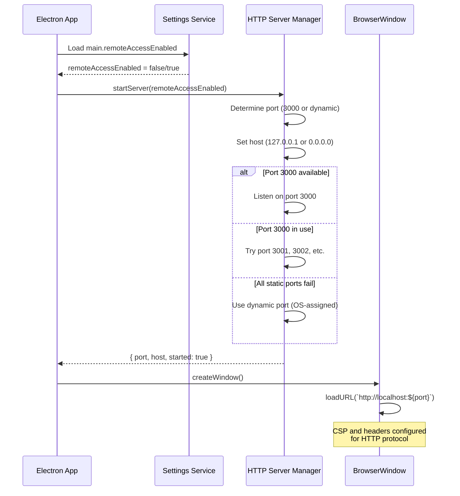
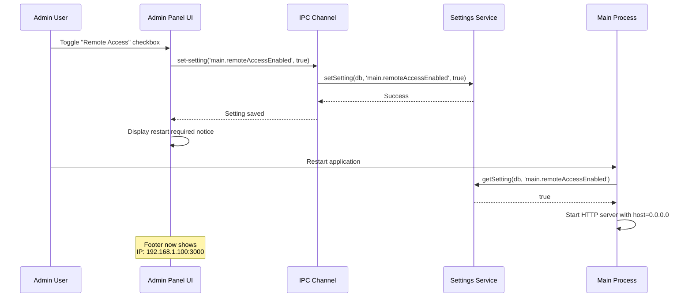

# Technical Design Document

## Overview

This document specifies the technical design for implementing a local HTTP server in SafeTube's main process to serve the renderer application. This replaces the `file://` protocol approach in production builds, enabling proper YouTube iframe functionality while maintaining security and optionally allowing remote LAN access.

## Architecture

### High-Level Architecture

```
┌─────────────────────────────────────────────────────────────┐
│                       Main Process                           │
│  ┌───────────────────────────────────────────────────────┐  │
│  │           HTTP Server Manager Service                 │  │
│  │  - Port management (default: 3000, fallback: dynamic) │  │
│  │  - Static file serving from dist/renderer/            │  │
│  │  - Binding configuration (127.0.0.1 vs 0.0.0.0)       │  │
│  │  - Lifecycle management (start/stop)                  │  │
│  └───────────────────────────────────────────────────────┘  │
│                           ↕                                  │
│  ┌───────────────────────────────────────────────────────┐  │
│  │         Settings Service (Database-backed)            │  │
│  │  - main.remoteAccessEnabled (boolean)                 │  │
│  │  - main.httpServerPort (number, optional)             │  │
│  └───────────────────────────────────────────────────────┘  │
│                           ↕                                  │
│  ┌───────────────────────────────────────────────────────┐  │
│  │              IPC Handlers (New)                       │  │
│  │  - get-server-info → { port, host, remoteEnabled }   │  │
│  │  - get-network-info → { localIP, port }              │  │
│  └───────────────────────────────────────────────────────┘  │
└─────────────────────────────────────────────────────────────┘
                            ↓ HTTP
┌─────────────────────────────────────────────────────────────┐
│                     Renderer Process                         │
│  - Loads via http://localhost:[port]/ (production)          │
│  - Loads via http://localhost:5173/ (development)           │
│  - Footer displays network info when remote access enabled  │
└─────────────────────────────────────────────────────────────┘
```

### Data Flow: Server Initialization



### Data Flow: Remote Access Toggle



## Components and Interfaces

### 1. HTTP Server Manager (`src/main/services/HttpServerManager.ts`)

**Responsibility:** Manages the HTTP server lifecycle, static file serving, and port management.

**Interface:**
```typescript
interface ServerConfig {
  port: number;
  host: string; // '127.0.0.1' or '0.0.0.0'
  distPath: string; // Path to dist/renderer/
}

interface ServerInfo {
  started: boolean;
  port: number;
  host: string;
  url: string; // e.g., 'http://localhost:3000'
}

class HttpServerManager {
  private server: http.Server | null;
  private config: ServerConfig;

  constructor(config: ServerConfig);

  /**
   * Start the HTTP server
   * @returns ServerInfo with actual port and host used
   * @throws Error if server fails to start after all retries
   */
  async start(): Promise<ServerInfo>;

  /**
   * Stop the HTTP server and release the port
   */
  async stop(): Promise<void>;

  /**
   * Get current server info (null if not started)
   */
  getInfo(): ServerInfo | null;

  /**
   * Check if a specific port is available
   */
  private async isPortAvailable(port: number): Promise<boolean>;

  /**
   * Find next available port starting from preferred port
   */
  private async findAvailablePort(startPort: number, maxAttempts: number): Promise<number>;

  /**
   * Handle static file serving
   */
  private handleRequest(req: http.IncomingMessage, res: http.ServerResponse): void;
}
```

**Port Selection Strategy:**
1. Try preferred port (3000) first
2. If port 3000 busy, try 3001, 3002, 3003 (up to 3 additional attempts)
3. If all static ports fail, request OS-assigned port (port 0)
4. Log all port selection activity

**Static File Serving Logic:**
```typescript
private handleRequest(req: http.IncomingMessage, res: http.ServerResponse): void {
  // Parse URL
  const parsedUrl = url.parse(req.url || '/');
  let pathname = parsedUrl.pathname || '/';

  // Default to index.html for root and SPA routes
  if (pathname === '/' || !pathname.includes('.')) {
    pathname = '/index.html';
  }

  // Build file path
  const filePath = path.join(this.config.distPath, pathname);

  // Security: Prevent directory traversal
  const normalizedPath = path.normalize(filePath);
  if (!normalizedPath.startsWith(this.config.distPath)) {
    res.writeHead(403);
    res.end('Forbidden');
    return;
  }

  // Serve file with appropriate Content-Type
  fs.readFile(filePath, (err, data) => {
    if (err) {
      if (err.code === 'ENOENT') {
        // SPA fallback: serve index.html for 404s
        fs.readFile(path.join(this.config.distPath, 'index.html'), (err, data) => {
          if (err) {
            res.writeHead(500);
            res.end('Server error');
          } else {
            res.writeHead(200, { 'Content-Type': 'text/html' });
            res.end(data);
          }
        });
      } else {
        res.writeHead(500);
        res.end('Server error');
      }
    } else {
      const ext = path.extname(filePath);
      const contentType = getContentType(ext);
      res.writeHead(200, { 'Content-Type': contentType });
      res.end(data);
    }
  });
}
```

**MIME Type Mapping:**
```typescript
function getContentType(ext: string): string {
  const types: Record<string, string> = {
    '.html': 'text/html',
    '.js': 'application/javascript',
    '.css': 'text/css',
    '.json': 'application/json',
    '.png': 'image/png',
    '.jpg': 'image/jpeg',
    '.jpeg': 'image/jpeg',
    '.gif': 'image/gif',
    '.svg': 'image/svg+xml',
    '.ico': 'image/x-icon',
    '.woff': 'font/woff',
    '.woff2': 'font/woff2',
    '.ttf': 'font/ttf',
    '.eot': 'application/vnd.ms-fontobject',
  };
  return types[ext] || 'application/octet-stream';
}
```

### 2. Network Utility Service (`src/main/services/NetworkUtils.ts`)

**Responsibility:** Detect local network IP addresses for display in footer.

**Interface:**
```typescript
interface NetworkInfo {
  localIP: string; // Primary local network IP (e.g., 192.168.1.100)
  interfaces: Array<{
    name: string;
    address: string;
    family: 'IPv4' | 'IPv6';
    internal: boolean;
  }>;
}

class NetworkUtils {
  /**
   * Get primary local network IP address
   * Excludes localhost (127.0.0.1) and IPv6
   * Prefers 192.168.x.x or 10.x.x.x addresses
   */
  static getLocalIPAddress(): string;

  /**
   * Get all network interface information
   */
  static getAllNetworkInterfaces(): NetworkInfo;
}
```

**Implementation Strategy:**
```typescript
static getLocalIPAddress(): string {
  const nets = os.networkInterfaces();

  for (const name of Object.keys(nets)) {
    const interfaces = nets[name];
    if (!interfaces) continue;

    for (const net of interfaces) {
      // Skip internal (loopback) and non-IPv4 addresses
      if (net.family === 'IPv4' && !net.internal) {
        // Prefer private network addresses
        if (net.address.startsWith('192.168.') ||
            net.address.startsWith('10.') ||
            net.address.startsWith('172.')) {
          return net.address;
        }
      }
    }
  }

  return '127.0.0.1'; // Fallback
}
```

### 3. Main Process Integration (`src/main/main.ts`)

**Changes to `createWindow()` function:**

```typescript
async function createWindow() {
  const preloadPath = path.join(__dirname, '../../preload/index.js');

  const mainWindow = new BrowserWindow({
    width: 1200,
    height: 800,
    webPreferences: {
      nodeIntegration: false,
      contextIsolation: true,
      preload: preloadPath,
      webSecurity: false // Allow cross-origin requests
    }
  });

  const isDev = process.env.NODE_ENV === 'development';

  if (isDev) {
    // Development: Use Vite dev server
    mainWindow.loadURL('http://localhost:5173');
    mainWindow.webContents.openDevTools();
  } else {
    // Production: Use local HTTP server
    const serverInfo = await httpServerManager.getInfo();
    if (serverInfo && serverInfo.started) {
      const url = `http://localhost:${serverInfo.port}`;
      log.info('[Main] Loading from local HTTP server:', url);
      mainWindow.loadURL(url);
    } else {
      log.error('[Main] HTTP server not started, falling back to file://');
      // Fallback to file:// protocol
      const localPath = path.join(process.cwd(), 'dist', 'renderer', 'index.html');
      const asarPath = path.join(process.resourcesPath, 'app.asar', 'dist', 'renderer', 'index.html');

      if (fs.existsSync(localPath)) {
        mainWindow.loadFile(localPath);
      } else if (fs.existsSync(asarPath)) {
        mainWindow.loadFile(asarPath);
      }
    }
  }

  // Update CSP for localhost HTTP server
  configureSecurityHeaders(mainWindow);
}
```

**Server Initialization in `app.whenReady()`:**

```typescript
app.whenReady().then(async () => {
  // Register IPC handlers first
  registerIpcHandlers();

  // Start HTTP server in production mode
  if (process.env.NODE_ENV !== 'development') {
    try {
      // Load remote access setting from database
      const db = await DatabaseService.getInstance();
      const remoteAccessEnabled = await getSetting<boolean>(
        db,
        'main.remoteAccessEnabled',
        false // default to localhost only
      );

      // Determine paths
      const distPath = fs.existsSync(path.join(process.cwd(), 'dist', 'renderer'))
        ? path.join(process.cwd(), 'dist', 'renderer')
        : path.join(process.resourcesPath, 'app.asar', 'dist', 'renderer');

      // Create and start HTTP server
      httpServerManager = new HttpServerManager({
        port: 3000,
        host: remoteAccessEnabled ? '0.0.0.0' : '127.0.0.1',
        distPath
      });

      const serverInfo = await httpServerManager.start();
      log.info('[Main] HTTP server started:', serverInfo);

      // Store server info globally for IPC handlers
      global.serverInfo = serverInfo;

    } catch (error) {
      log.error('[Main] Failed to start HTTP server:', error);
      // Continue without HTTP server (will fallback to file://)
    }
  }

  // Initialize video sources...
  // Create window...
});
```

**Cleanup on quit:**

```typescript
app.on('will-quit', async () => {
  if (httpServerManager) {
    await httpServerManager.stop();
    log.info('[Main] HTTP server stopped');
  }
});
```

### 4. IPC Handlers (`src/main/ipc/serverHandlers.ts`)

**New IPC handlers for server information:**

```typescript
import { ipcMain } from 'electron';
import { IPC } from '../../shared/ipc-channels';
import { NetworkUtils } from '../services/NetworkUtils';

export function registerServerHandlers(serverManager: HttpServerManager | null) {
  /**
   * Get HTTP server information
   */
  ipcMain.handle(IPC.SERVER.GET_SERVER_INFO, async () => {
    if (!serverManager) {
      return null;
    }

    const info = serverManager.getInfo();
    return info;
  });

  /**
   * Get network information for remote access display
   */
  ipcMain.handle(IPC.SERVER.GET_NETWORK_INFO, async () => {
    const serverInfo = serverManager?.getInfo();

    if (!serverInfo || !serverInfo.started) {
      return null;
    }

    // Only return network info if bound to 0.0.0.0
    if (serverInfo.host !== '0.0.0.0') {
      return null;
    }

    const localIP = NetworkUtils.getLocalIPAddress();

    return {
      localIP,
      port: serverInfo.port,
      url: `http://${localIP}:${serverInfo.port}`
    };
  });
}
```

### 5. IPC Channel Definitions (`src/shared/ipc-channels.ts`)

**Add new SERVER section:**

```typescript
export const IPC = {
  // ... existing sections ...

  // ============================================================================
  // HTTP SERVER
  // ============================================================================

  SERVER: {
    GET_SERVER_INFO: 'server:get-info',
    GET_NETWORK_INFO: 'server:get-network-info',
  },

  // ... rest of definitions ...
} as const;
```

### 6. Admin Panel UI Integration (`src/renderer/components/AdminPanel.tsx`)

**Add Remote Access control in Main Settings tab:**

```typescript
interface MainSettings {
  // ... existing settings ...
  remoteAccessEnabled: boolean;
}

function AdminPanel() {
  const [settings, setSettings] = useState<MainSettings>({
    // ... existing defaults ...
    remoteAccessEnabled: false,
  });

  const [restartRequired, setRestartRequired] = useState(false);

  useEffect(() => {
    // Load settings from database
    async function loadSettings() {
      const dbSettings = await window.electron.invoke(
        IPC.DB_SETTINGS.GET_BY_NAMESPACE,
        'main'
      );
      setSettings({
        // ... map settings ...
        remoteAccessEnabled: dbSettings.remoteAccessEnabled ?? false,
      });
    }
    loadSettings();
  }, []);

  const handleRemoteAccessToggle = async (enabled: boolean) => {
    setSettings({ ...settings, remoteAccessEnabled: enabled });

    await window.electron.invoke(
      IPC.DB_SETTINGS.SET_SETTING,
      'main.remoteAccessEnabled',
      enabled
    );

    setRestartRequired(true);
  };

  return (
    <div className="admin-panel">
      {/* ... existing content ... */}

      <div className="settings-section">
        <h3>Network Settings</h3>

        <label className="checkbox-label">
          <input
            type="checkbox"
            checked={settings.remoteAccessEnabled}
            onChange={(e) => handleRemoteAccessToggle(e.target.checked)}
          />
          <span>Enable Remote Access (Allow access from other devices on local network)</span>
        </label>

        {settings.remoteAccessEnabled && (
          <div className="info-message">
            <InfoIcon />
            <p>
              When enabled, SafeTube will be accessible from other devices on your local network.
              The admin panel will be available at http://[YOUR-IP]:[PORT]/admin
            </p>
          </div>
        )}

        {restartRequired && (
          <div className="warning-message">
            <WarningIcon />
            <p>Application restart required for network settings to take effect.</p>
            <button onClick={() => window.electron.invoke('app:restart')}>
              Restart Now
            </button>
          </div>
        )}
      </div>
    </div>
  );
}
```

### 7. Network Info Footer Component (`src/renderer/components/NetworkInfoFooter.tsx`)

**New component to display network info when remote access is enabled:**

```typescript
import React, { useEffect, useState } from 'react';
import { IPC } from '../../shared/ipc-channels';

interface NetworkInfo {
  localIP: string;
  port: number;
  url: string;
}

export function NetworkInfoFooter() {
  const [networkInfo, setNetworkInfo] = useState<NetworkInfo | null>(null);

  useEffect(() => {
    async function fetchNetworkInfo() {
      const info = await window.electron.invoke(IPC.SERVER.GET_NETWORK_INFO);
      setNetworkInfo(info);
    }

    fetchNetworkInfo();

    // Refresh every 30 seconds in case IP changes
    const interval = setInterval(fetchNetworkInfo, 30000);

    return () => clearInterval(interval);
  }, []);

  if (!networkInfo) {
    return null; // Don't render if remote access is disabled
  }

  return (
    <div className="network-info-footer">
      <span className="network-info-text">
        Network: {networkInfo.url}
      </span>
    </div>
  );
}
```

**Styling (scoped to component):**

```css
.network-info-footer {
  position: fixed;
  bottom: 0;
  left: 0;
  right: 0;
  background: rgba(0, 0, 0, 0.7);
  padding: 4px 12px;
  text-align: center;
  z-index: 1000;
}

.network-info-text {
  color: #999;
  font-size: 11px;
  font-family: monospace;
}
```

**Integration in main App component:**

```typescript
function App() {
  return (
    <div className="app">
      {/* ... existing routes and content ... */}

      <NetworkInfoFooter />
    </div>
  );
}
```

## Data Models

### Settings Schema (Database)

**Settings table entries:**

| Key | Type | Description | Default Value |
|-----|------|-------------|---------------|
| `main.remoteAccessEnabled` | boolean | Enable remote access from LAN | `false` |
| `main.httpServerPort` | number | Preferred HTTP server port (optional) | `3000` |

### Global Types (`src/shared/types/server.ts`)

```typescript
/**
 * HTTP Server configuration
 */
export interface ServerConfig {
  port: number;
  host: '127.0.0.1' | '0.0.0.0';
  distPath: string;
}

/**
 * HTTP Server runtime information
 */
export interface ServerInfo {
  started: boolean;
  port: number;
  host: string;
  url: string;
}

/**
 * Network information for remote access display
 */
export interface NetworkInfo {
  localIP: string;
  port: number;
  url: string;
}
```

## Error Handling

### Port Conflict Resolution

**Strategy:**
1. Attempt to bind to preferred port (3000)
2. If EADDRINUSE error, increment port and retry (3001, 3002, 3003)
3. After 3 retries, use OS-assigned port (port 0)
4. Log all port selection attempts and final port used
5. If server completely fails to start, log error and fallback to file:// protocol

**Error Messages:**

```typescript
class HttpServerError extends Error {
  constructor(
    message: string,
    public code: 'PORT_IN_USE' | 'PERMISSION_DENIED' | 'UNKNOWN',
    public port?: number
  ) {
    super(message);
    this.name = 'HttpServerError';
  }
}
```

**Logging:**

```typescript
try {
  const serverInfo = await httpServerManager.start();
  log.info('[HttpServer] Server started successfully', serverInfo);
} catch (error) {
  if (error instanceof HttpServerError) {
    if (error.code === 'PORT_IN_USE') {
      log.error(`[HttpServer] Port ${error.port} is in use. Attempted fallback but all ports failed.`);
    } else if (error.code === 'PERMISSION_DENIED') {
      log.error('[HttpServer] Permission denied. Try running as administrator or use a different port.');
    }
  }
  log.error('[HttpServer] Full error:', error);

  // Fallback to file:// protocol
  log.warn('[HttpServer] Falling back to file:// protocol. YouTube iframes may not work correctly.');
}
```

### Static File Serving Errors

**404 Handling:**
- For missing files with extensions (`.js`, `.css`, etc.): Return 404 with error page
- For missing routes (SPA routes): Serve `index.html` to allow React Router to handle routing

**Security Errors:**
- Directory traversal attempts: Return 403 Forbidden
- Log security violation attempts

**Server Errors:**
- File system read errors: Return 500 Internal Server Error
- Log full error details for debugging

## Security and CSP Updates

### Content Security Policy Updates

**Current CSP (for file:// protocol):**
```
default-src 'self' 'unsafe-inline' 'unsafe-eval';
media-src 'self' file: blob: data: http://localhost:* https://*.youtube.com ...;
...
```

**Updated CSP (for http://localhost:[port]):**

```typescript
function getCSP(port: number): string {
  return [
    "default-src 'self' 'unsafe-inline' 'unsafe-eval'",
    `connect-src 'self' http://localhost:${port} http://localhost:* https://*.googlevideo.com https://www.youtube.com https://www.youtube-nocookie.com https://youtube.com`,
    "media-src 'self' file: blob: data: http://localhost:* https://*.youtube.com https://*.youtube-nocookie.com https://*.googlevideo.com",
    "img-src 'self' file: blob: data: https: http:",
    "script-src 'self' 'unsafe-inline' 'unsafe-eval' https://www.youtube.com https://www.youtube-nocookie.com https://s.ytimg.com",
    "frame-src 'self' https://www.youtube.com https://www.youtube-nocookie.com",
  ].join('; ');
}

function configureSecurityHeaders(mainWindow: BrowserWindow, serverPort?: number) {
  mainWindow.webContents.session.webRequest.onHeadersReceived((details, callback) => {
    const csp = serverPort ? getCSP(serverPort) : getCSP(5173); // fallback to dev port

    callback({
      responseHeaders: {
        ...details.responseHeaders,
        'Access-Control-Allow-Origin': ['*'],
        'Access-Control-Allow-Methods': ['GET, POST, OPTIONS'],
        'Access-Control-Allow-Headers': ['Content-Type'],
        'Referrer-Policy': ['strict-origin-when-cross-origin'], // Critical for YouTube iframe
        'Content-Security-Policy': [csp],
      }
    });
  });
}
```

### Referrer Policy

**Critical for YouTube iframe API (fixes error 153):**

```
Referrer-Policy: strict-origin-when-cross-origin
```

This ensures YouTube iframes receive proper HTTP Referer headers, which YouTube requires to validate embed requests.

### CORS Headers

**Maintain existing CORS configuration:**

```typescript
mainWindow.webContents.session.webRequest.onBeforeSendHeaders((details, callback) => {
  callback({
    requestHeaders: {
      ...details.requestHeaders,
      'Origin': `http://localhost:${serverPort}`,
      'Access-Control-Allow-Origin': '*',
      'Access-Control-Allow-Methods': 'GET, POST, OPTIONS',
      'Access-Control-Allow-Headers': 'Content-Type'
    }
  });
});
```

## Testing Strategy

### Unit Tests

**`HttpServerManager.test.ts`:**
- ✓ Server starts on preferred port
- ✓ Server falls back to next port when preferred is in use
- ✓ Server uses OS-assigned port after max retries
- ✓ Server stops and releases port
- ✓ Server serves static files correctly
- ✓ Server handles 404 with SPA fallback
- ✓ Server rejects directory traversal attempts
- ✓ MIME types are set correctly for common file extensions

**`NetworkUtils.test.ts`:**
- ✓ Returns local network IP address
- ✓ Excludes localhost (127.0.0.1)
- ✓ Prefers private network addresses (192.168.x.x, 10.x.x.x)
- ✓ Handles systems with no network interfaces

**`serverHandlers.test.ts`:**
- ✓ GET_SERVER_INFO returns correct server information
- ✓ GET_NETWORK_INFO returns null when remote access disabled
- ✓ GET_NETWORK_INFO returns network info when remote access enabled

### Integration Tests

**`http-server-integration.test.ts`:**
- ✓ Full server lifecycle: start → serve files → stop
- ✓ Server switches between localhost and 0.0.0.0 binding
- ✓ Settings persistence: remote access toggle is saved and loaded
- ✓ BrowserWindow loads correctly from HTTP server

**`youtube-iframe.test.ts`:**
- ✓ YouTube iframe loads without error 153
- ✓ YouTube iframe API functions correctly
- ✓ Referer header is sent correctly

### Manual Testing

**Testing remote access:**
1. Enable remote access in admin panel
2. Restart application
3. Note IP address in footer
4. From another device on same network, navigate to `http://[IP]:[PORT]/admin`
5. Verify admin panel is accessible and functional

**Testing port conflicts:**
1. Start another service on port 3000
2. Start SafeTube
3. Verify SafeTube uses port 3001
4. Check logs for port selection messages

## Migration and Deployment

### Backward Compatibility

**Graceful degradation:**
- If HTTP server fails to start, fallback to `file://` protocol
- Log warning that YouTube iframes may not work correctly
- Application remains functional for local video playback

**First-time users:**
- Remote access defaults to `false` (localhost only)
- No database migration needed (settings use upsert pattern)

### Build Process

**No changes required to build process:**
- HTTP server uses existing `dist/renderer/` output
- Server code is part of main process bundle
- No additional build steps needed

### Testing in Production Build

**Verification steps:**
1. Build production version: `yarn build:all`
2. Start packaged app
3. Verify loads via `http://localhost:3000` (check DevTools Network tab)
4. Verify YouTube iframes play without error 153
5. Enable remote access, restart, verify accessible from another device
6. Check logs for server startup messages

## Performance Considerations

### Server Performance

**Static file serving is lightweight:**
- Files served directly from disk (no processing)
- MIME types determined by file extension
- No database queries for file serving
- Expected overhead: <10ms per request

**Startup time:**
- Port availability check: ~5-10ms per port
- Server initialization: ~20-50ms
- Total impact on app startup: <100ms

### Memory Usage

**Minimal memory overhead:**
- HTTP server: ~1-2MB
- No file caching (rely on OS file system cache)
- Connection limit: default (Node.js built-in limits)

## Open Questions and Future Enhancements

### Answered in Requirements

✓ Port selection strategy
✓ Remote access configuration
✓ Settings persistence
✓ Network info display

### Future Enhancements (Out of Scope)

1. **HTTPS support:** Add TLS/SSL for encrypted communication
2. **Authentication for remote access:** Require password for remote connections
3. **Custom port selection:** Allow user to specify preferred port in admin panel
4. **Bandwidth limiting:** Throttle remote access bandwidth
5. **Access logging:** Track remote access attempts
6. **Multi-device awareness:** Show list of connected devices
7. **Wake-on-LAN:** Allow remote wake of SafeTube device

## Appendix: File Structure

**New files:**
```
src/
├── main/
│   ├── services/
│   │   ├── HttpServerManager.ts       # HTTP server implementation
│   │   └── NetworkUtils.ts            # Network IP detection
│   ├── ipc/
│   │   └── serverHandlers.ts          # Server IPC handlers
│   └── __tests__/
│       ├── HttpServerManager.test.ts
│       ├── NetworkUtils.test.ts
│       └── http-server-integration.test.ts
├── renderer/
│   └── components/
│       └── NetworkInfoFooter.tsx      # Network info display
└── shared/
    └── types/
        └── server.ts                  # Server-related type definitions
```

**Modified files:**
```
src/
├── main/
│   └── main.ts                        # Server initialization, CSP updates
├── renderer/
│   └── components/
│       └── AdminPanel.tsx             # Remote access toggle
└── shared/
    └── ipc-channels.ts                # New SERVER IPC channels
```
