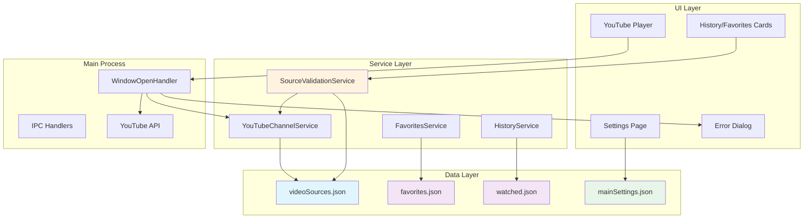

# Source-Based Video Access Control Design

## Overview

The Source-Based Video Access Control system implements a comprehensive validation layer to ensure videos can only be accessed when their originating source remains in the approved sources list. This design extends SafeTube's existing parental control infrastructure with validation logic, data model enhancements, and UI feedback mechanisms.

## Architecture Overview



## Data Model Changes

### 1. FavoriteVideo Interface Enhancement

**File**: `src/shared/types.ts`

```typescript
export interface FavoriteVideo {
  videoId: string;
  dateAdded: string;
  sourceType: 'youtube' | 'local' | 'dlna' | 'downloaded';
  sourceId: string;  // ê NEW: Required field for source validation
  title: string;
  thumbnail?: string;
  duration?: number;
}
```

**Migration Strategy**:
- Existing favorites without `sourceId` will be migrated on app startup
- Migration attempts to match favorites with current sources via video metadata
- If no match found, favorite is marked with `sourceId: 'unknown'` (unavailable)

### 2. YouTubeChannelSource Enhancement

**File**: `src/shared/types.ts`

```typescript
export interface YouTubeChannelSource {
  id: string;
  type: 'youtube_channel';
  url: string;
  title: string;
  channelId?: string;  // ê NEW: Optional initially, fetched from YouTube API
  sortOrder?: 'newestFirst' | 'oldestFirst';
}
```

**Channel ID Population**:
- Fetched when source is created using YouTube API
- Cached in source configuration to avoid repeated API calls
- If missing, fetched lazily on first validation attempt

### 3. MainSettings Enhancement

**File**: `src/shared/types.ts`

```typescript
export interface MainSettings {
  downloadPath?: string;
  youtubeApiKey?: string;
  adminPassword?: string;
  enableVerboseLogging?: boolean;
  customBeepSound?: string;
  allowYouTubeClicksToOtherVideos?: boolean;  // ê NEW: Defaults to false (most restrictive)
}
```

**Setting Behavior**:
- `undefined` or `false`: Block ALL YouTube iframe clicks (current behavior)
- `true`: Validate clicked video's channelId against approved channels

### 4. WatchedVideo Enhancement

**Current State**: Already has `source` field 
```typescript
export interface WatchedVideo {
  videoId: string;
  position: number;
  lastWatched: string;
  timeWatched: number;
  duration: number;
  watched: boolean;
  title: string;
  thumbnail: string;
  source: string;  // ê Already exists, used for validation
  firstWatched: string;
}
```

## Source Validation Service

### Core Validation Logic

**File**: `src/renderer/services/sourceValidationService.ts`

```typescript
export class SourceValidationService {
  private static sourceCache: Map<string, boolean> = new Map();
  private static channelCache: Map<string, string[]> = new Map(); // channelId -> [sourceIds]

  /**
   * Validates if a video's source is still approved
   * @param videoId - The video identifier
   * @param sourceId - The source identifier from favorites/history
   * @param sourceType - Type of source (youtube, local, etc.)
   * @returns true if video is accessible, false otherwise
   */
  static async isVideoSourceValid(
    videoId: string,
    sourceId: string,
    sourceType: 'youtube' | 'local' | 'dlna' | 'downloaded' | 'youtube_playlist'
  ): Promise<boolean> {
    // Check cache first
    const cacheKey = `${sourceId}:${sourceType}`;
    if (this.sourceCache.has(cacheKey)) {
      return this.sourceCache.get(cacheKey)!;
    }

    // Load current approved sources
    const sources = await window.electron.getVideoSources();

    // Validate based on source type
    let isValid = false;

    if (sourceType === 'youtube_playlist') {
      // Playlists: just check if source exists
      isValid = sources.some(s => s.id === sourceId && s.type === 'youtube_playlist');
    } else if (sourceType === 'youtube') {
      // YouTube videos: check if source exists
      isValid = sources.some(s => s.id === sourceId && s.type === 'youtube_channel');
    } else if (sourceType === 'local') {
      // Local videos: check if source exists
      isValid = sources.some(s => s.id === sourceId && s.type === 'local');
    }

    // Cache result
    this.sourceCache.set(cacheKey, isValid);

    return isValid;
  }

  /**
   * Validates if a YouTube video's channel is in approved channels
   * @param channelId - The YouTube channel ID
   * @returns true if channel is approved, false otherwise
   */
  static async isChannelApproved(channelId: string): Promise<boolean> {
    // Check channel cache
    if (this.channelCache.has(channelId)) {
      return this.channelCache.get(channelId)!.length > 0;
    }

    // Load current approved sources
    const sources = await window.electron.getVideoSources();

    // Find channel sources that match this channelId
    const approvedSources = sources
      .filter(s => s.type === 'youtube_channel' && (s as any).channelId === channelId)
      .map(s => s.id);

    // Cache result
    this.channelCache.set(channelId, approvedSources);

    return approvedSources.length > 0;
  }

  /**
   * Fetches video metadata to get channel ID
   * @param videoId - YouTube video ID
   * @returns Channel ID or null if not found
   */
  static async getVideoChannelId(videoId: string): Promise<string | null> {
    try {
      const videoInfo = await window.electron.getYouTubeVideoInfo(videoId);
      return videoInfo.channelId || null;
    } catch (error) {
      console.error(`Failed to fetch channel ID for video ${videoId}:`, error);
      return null;
    }
  }

  /**
   * Clears validation cache (call when sources change)
   */
  static clearCache(): void {
    this.sourceCache.clear();
    this.channelCache.clear();
  }

  /**
   * Batch validate multiple videos for performance
   * @param videos - Array of videos to validate
   * @returns Map of videoId -> isValid
   */
  static async batchValidateVideos(
    videos: Array<{ videoId: string; sourceId: string; sourceType: string }>
  ): Promise<Map<string, boolean>> {
    const results = new Map<string, boolean>();

    // Load sources once
    const sources = await window.electron.getVideoSources();
    const sourceIds = new Set(sources.map(s => s.id));

    // Validate each video
    for (const video of videos) {
      const isValid = sourceIds.has(video.sourceId);
      results.set(video.videoId, isValid);
    }

    return results;
  }
}
```

## YouTube Click Interception

### Window Open Handler Enhancement

**File**: `src/main/index.ts` (lines 1288-1307)

**Current Implementation**:
```typescript
mainWindow.webContents.setWindowOpenHandler((details) => {
  // Check if it's a YouTube URL that should be played internally
  if (details.url.startsWith('https://www.youtube.com/watch') || details.url.startsWith('https://www.youtu.be/')) {
    let videoId = '';
    const match = details.url.match(/(?:youtube\.com\/watch\?v=|youtu\.be\/)([^&\n?#]+)/);
    if (match) {
      videoId = match[1];
      mainWindow.webContents.send('navigate-to-video', videoId);
      return { action: 'deny' };
    }
  }
  return { action: 'deny' };
})
```

**Enhanced Implementation**:
```typescript
mainWindow.webContents.setWindowOpenHandler(async (details) => {
  // Check if it's a YouTube URL
  if (details.url.startsWith('https://www.youtube.com/watch') || details.url.startsWith('https://www.youtu.be/')) {
    let videoId = '';
    const match = details.url.match(/(?:youtube\.com\/watch\?v=|youtu\.be\/)([^&\n?#]+)/);

    if (match) {
      videoId = match[1];

      // Load main settings
      const settings = await readMainSettings();
      const allowClicksToOtherVideos = settings.allowYouTubeClicksToOtherVideos || false;

      if (allowClicksToOtherVideos) {
        // Validate channel ID against approved sources
        try {
          // Fetch video info to get channel ID
          const videoInfo = await YouTubeAPI.getVideoDetails(videoId);
          const channelId = videoInfo.snippet.channelId;

          // Load video sources
          const sources = await readVideoSources();
          const approvedChannelIds = sources
            .filter(s => s.type === 'youtube_channel')
            .map(s => (s as YouTubeChannelSource).channelId)
            .filter(Boolean);

          // Check if channel is approved
          if (approvedChannelIds.includes(channelId)) {
            // Allow playback
            mainWindow.webContents.send('navigate-to-video', videoId);
          } else {
            // Block and show error
            mainWindow.webContents.send('show-channel-not-approved-error', {
              videoId,
              channelId,
              title: videoInfo.snippet.title
            });
          }
        } catch (error) {
          // On error, deny access
          console.error('Error validating YouTube video channel:', error);
          mainWindow.webContents.send('show-validation-error', {
            message: 'Unable to validate video channel'
          });
        }
      } else {
        // Original behavior: block all clicks
        // (just deny, no navigation)
      }

      return { action: 'deny' };
    }
  }

  return { action: 'deny' };
})
```

## UI Component Design

### Grayed-Out Video Card

**File**: `src/renderer/components/video/VideoCardBase.tsx`

```typescript
interface VideoCardBaseProps {
  // ... existing props
  isAvailable?: boolean;  // NEW: Controls grayed-out state
  unavailableReason?: string;  // NEW: Reason for unavailability
}

export const VideoCardBase: React.FC<VideoCardBaseProps> = ({
  // ... existing props
  isAvailable = true,
  unavailableReason = 'This video is no longer available',
  ...props
}) => {
  const cardClasses = cn(
    'relative rounded-lg overflow-hidden transition-all',
    isAvailable
      ? 'hover:shadow-lg cursor-pointer'
      : 'opacity-50 cursor-not-allowed',
    className
  );

  const handleClick = () => {
    if (!isAvailable) return;  // Prevent click if unavailable
    // ... existing click logic
  };

  return (
    <div className={cardClasses} onClick={handleClick}>
      {/* Unavailable indicator overlay */}
      {!isAvailable && (
        <div className="absolute inset-0 flex items-center justify-center bg-black/40 z-20">
          <div className="flex flex-col items-center gap-2">
            <Lock className="w-8 h-8 text-white" />
            <span className="text-white text-sm text-center px-4">
              {unavailableReason}
            </span>
          </div>
        </div>
      )}

      {/* ... existing card content */}
    </div>
  );
};
```

### Error Dialog Component

**File**: `src/renderer/components/dialogs/ChannelNotApprovedDialog.tsx`

```typescript
interface ChannelNotApprovedDialogProps {
  isOpen: boolean;
  onClose: () => void;
  videoTitle?: string;
}

export const ChannelNotApprovedDialog: React.FC<ChannelNotApprovedDialogProps> = ({
  isOpen,
  onClose,
  videoTitle
}) => {
  return (
    <Dialog open={isOpen} onClose={onClose}>
      <DialogContent className="sm:max-w-md">
        <DialogHeader>
          <DialogTitle className="flex items-center gap-2">
            <AlertCircle className="w-5 h-5 text-yellow-500" />
            Video Not Available
          </DialogTitle>
        </DialogHeader>

        <div className="py-4">
          <p className="text-gray-700">
            This video's channel is not in your approved sources.
          </p>
          {videoTitle && (
            <p className="text-sm text-gray-500 mt-2">
              Video: {videoTitle}
            </p>
          )}
        </div>

        <DialogFooter>
          <Button onClick={onClose} variant="primary">
            OK
          </Button>
        </DialogFooter>
      </DialogContent>
    </Dialog>
  );
};
```

## Integration Points

### History Page Integration

**File**: `src/renderer/pages/HistoryPage.tsx`

```typescript
const HistoryPage: React.FC = () => {
  const [historyVideos, setHistoryVideos] = useState<WatchedVideo[]>([]);
  const [validationResults, setValidationResults] = useState<Map<string, boolean>>(new Map());

  useEffect(() => {
    const loadAndValidateHistory = async () => {
      // Load history
      const history = await window.electron.getWatchHistory();
      setHistoryVideos(history);

      // Batch validate all videos
      const videosToValidate = history.map(v => ({
        videoId: v.videoId,
        sourceId: v.source,
        sourceType: determineSourceType(v)
      }));

      const results = await SourceValidationService.batchValidateVideos(videosToValidate);
      setValidationResults(results);
    };

    loadAndValidateHistory();
  }, []);

  return (
    <div className="history-page">
      <div className="video-grid">
        {historyVideos.map(video => (
          <VideoCardBase
            key={video.videoId}
            {...video}
            isAvailable={validationResults.get(video.videoId) ?? true}
            unavailableReason="This video's source is no longer approved"
          />
        ))}
      </div>
    </div>
  );
};
```

### Favorites Page Integration

**File**: `src/renderer/pages/FavoritesPage.tsx`

```typescript
const FavoritesPage: React.FC = () => {
  const [favorites, setFavorites] = useState<FavoriteVideo[]>([]);
  const [validationResults, setValidationResults] = useState<Map<string, boolean>>(new Map());

  useEffect(() => {
    const loadAndValidateFavorites = async () => {
      // Load favorites
      const favs = await window.electron.getFavorites();
      setFavorites(favs);

      // Batch validate
      const videosToValidate = favs.map(f => ({
        videoId: f.videoId,
        sourceId: f.sourceId,
        sourceType: f.sourceType
      }));

      const results = await SourceValidationService.batchValidateVideos(videosToValidate);
      setValidationResults(results);
    };

    loadAndValidateFavorites();
  }, []);

  return (
    <div className="favorites-page">
      <div className="video-grid">
        {favorites.map(fav => (
          <VideoCardBase
            key={fav.videoId}
            id={fav.videoId}
            title={fav.title}
            thumbnail={fav.thumbnail}
            duration={fav.duration}
            isAvailable={validationResults.get(fav.videoId) ?? true}
            unavailableReason="This video's source is no longer approved"
            isFavorite={true}
          />
        ))}
      </div>
    </div>
  );
};
```

## Settings UI Design

### Main Settings Page Enhancement

**File**: `src/renderer/pages/SettingsPage.tsx`

```tsx
<div className="settings-section">
  <h3 className="text-lg font-semibold mb-4">YouTube Click Control</h3>

  <div className="flex items-start gap-3">
    <input
      type="checkbox"
      id="allowYouTubeClicks"
      checked={!settings.allowYouTubeClicksToOtherVideos}
      onChange={(e) => handleSettingChange('allowYouTubeClicksToOtherVideos', !e.target.checked)}
      className="mt-1"
    />
    <div className="flex-1">
      <label htmlFor="allowYouTubeClicks" className="font-medium cursor-pointer">
        Block all clicks to related videos in YouTube player
      </label>
      <p className="text-sm text-gray-600 mt-1">
        When checked: Blocks all YouTube video clicks in the iframe player (most restrictive)
      </p>
      <p className="text-sm text-gray-600">
        When unchecked: Only blocks videos whose channels are not in your approved sources
      </p>
    </div>
  </div>
</div>
```

## Data Migration Strategy

### Favorites Migration

**File**: `src/main/migrations/favoritesSourceIdMigration.ts`

```typescript
export async function migrateFavoritesWithSourceId(): Promise<void> {
  const favorites = await readFavorites();
  const watchHistory = await readWatchHistory();
  const sources = await readVideoSources();

  let modified = false;

  for (const favorite of favorites) {
    // Skip if already has sourceId
    if (favorite.sourceId) continue;

    // Try to match with watch history
    const historyEntry = watchHistory.find(h => h.videoId === favorite.videoId);
    if (historyEntry?.source) {
      favorite.sourceId = historyEntry.source;
      modified = true;
      continue;
    }

    // For YouTube videos, try to match via channel
    if (favorite.sourceType === 'youtube') {
      try {
        const videoInfo = await YouTubeAPI.getVideoDetails(favorite.videoId);
        const channelId = videoInfo.snippet.channelId;

        const matchingSource = sources.find(
          s => s.type === 'youtube_channel' && (s as any).channelId === channelId
        );

        if (matchingSource) {
          favorite.sourceId = matchingSource.id;
          modified = true;
          continue;
        }
      } catch (error) {
        console.error(`Failed to fetch channel for favorite ${favorite.videoId}:`, error);
      }
    }

    // If no match found, mark as unknown
    favorite.sourceId = 'unknown';
    modified = true;
  }

  if (modified) {
    await writeFavorites(favorites);
    console.log(`Migrated ${favorites.length} favorites with source IDs`);
  }
}
```

### YouTube Channel ID Population

**File**: `src/main/migrations/channelIdPopulation.ts`

```typescript
export async function populateChannelIds(): Promise<void> {
  const sources = await readVideoSources();
  let modified = false;

  for (const source of sources) {
    if (source.type === 'youtube_channel' && !(source as any).channelId) {
      try {
        // Extract channel ID from URL using YouTube API
        const channelId = await extractChannelIdFromUrl(source.url);
        (source as any).channelId = channelId;
        modified = true;
      } catch (error) {
        console.error(`Failed to fetch channel ID for source ${source.id}:`, error);
      }
    }
  }

  if (modified) {
    await writeVideoSources(sources);
    console.log('Populated channel IDs for YouTube sources');
  }
}

async function extractChannelIdFromUrl(url: string): Promise<string> {
  // Handle @username format
  if (url.includes('/@')) {
    const username = url.match(/@([^\/\?]+)/)?.[1];
    if (username) {
      const channelInfo = await YouTubeAPI.searchChannelByUsername(username);
      return channelInfo.id;
    }
  }

  // Handle /channel/UC... format
  const channelMatch = url.match(/\/channel\/([^\/\?]+)/);
  if (channelMatch) {
    return channelMatch[1];
  }

  throw new Error(`Could not extract channel ID from URL: ${url}`);
}
```

## Performance Optimizations

### Caching Strategy

```typescript
class ValidationCache {
  private static CACHE_DURATION = 5 * 60 * 1000; // 5 minutes
  private static cache: Map<string, { value: boolean; timestamp: number }> = new Map();

  static get(key: string): boolean | null {
    const entry = this.cache.get(key);
    if (!entry) return null;

    const age = Date.now() - entry.timestamp;
    if (age > this.CACHE_DURATION) {
      this.cache.delete(key);
      return null;
    }

    return entry.value;
  }

  static set(key: string, value: boolean): void {
    this.cache.set(key, { value, timestamp: Date.now() });
  }

  static invalidate(): void {
    this.cache.clear();
  }
}
```

### Batch Validation

```typescript
// Load sources once per page load
const sources = await window.electron.getVideoSources();
const sourceIdSet = new Set(sources.map(s => s.id));

// Validate all videos in single pass
const validationResults = new Map(
  videos.map(v => [v.videoId, sourceIdSet.has(v.sourceId)])
);
```

## Error Handling

### Validation Error Handling

```typescript
try {
  const isValid = await SourceValidationService.isVideoSourceValid(
    videoId,
    sourceId,
    sourceType
  );

  if (!isValid) {
    // Show unavailable state
    setVideoAvailable(false);
  }
} catch (error) {
  console.error('Validation error:', error);

  // On error, default to available (fail-open for better UX)
  // But log warning for parent/admin review
  logVerbose('Source validation failed, defaulting to available:', error);
  setVideoAvailable(true);
}
```

### YouTube API Error Handling

```typescript
try {
  const channelId = await SourceValidationService.getVideoChannelId(videoId);

  if (!channelId) {
    // Deny access if channel ID unavailable
    showError('Unable to determine video channel');
    return;
  }

  const isApproved = await SourceValidationService.isChannelApproved(channelId);
  // ... continue
} catch (error) {
  if (error.code === 'RATE_LIMIT') {
    // Fall back to blocking all clicks
    showError('Too many requests, temporarily restricting access');
  } else {
    // Generic error handling
    showError('Unable to validate video');
  }
}
```

## Testing Strategy

### Unit Tests

```typescript
describe('SourceValidationService', () => {
  it('should validate videos with existing sources', async () => {
    const isValid = await SourceValidationService.isVideoSourceValid(
      'video123',
      'source456',
      'youtube'
    );
    expect(isValid).toBe(true);
  });

  it('should invalidate videos with deleted sources', async () => {
    const isValid = await SourceValidationService.isVideoSourceValid(
      'video123',
      'deleted_source',
      'youtube'
    );
    expect(isValid).toBe(false);
  });

  it('should validate YouTube channels correctly', async () => {
    const isApproved = await SourceValidationService.isChannelApproved('UC_channel_id');
    expect(isApproved).toBe(true);
  });
});
```

### Integration Tests

```typescript
describe('Favorites Migration', () => {
  it('should migrate favorites from watch history', async () => {
    // Setup test data
    await writeTestFavorites([{ videoId: 'test', sourceId: undefined }]);
    await writeTestWatchHistory([{ videoId: 'test', source: 'source1' }]);

    // Run migration
    await migrateFavoritesWithSourceId();

    // Verify
    const favorites = await readFavorites();
    expect(favorites[0].sourceId).toBe('source1');
  });
});
```

## Documentation Requirements

### Code Documentation
- TSDoc comments for all public interfaces
- Inline comments explaining validation logic
- Migration script documentation

### User Documentation
- Admin guide for YouTube click control setting
- Troubleshooting guide for unavailable videos
- Migration guide for existing installations